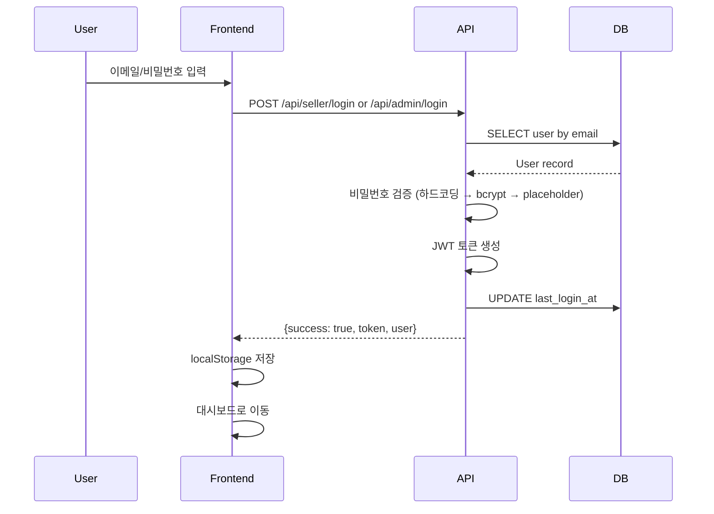

# 계정 정보 및 저장 구현 검증 보고서

**생성일시**: 2026-03-09  
**검증 대상**: 판매자(Seller) 및 관리자(Admin) 계정  
**검증자**: AI Developer Assistant

---

## 📋 목차

1. [계정 정보 확인](#1-계정-정보-확인)
2. [인증 구현 분석](#2-인증-구현-분석)
3. [저장 메커니즘 분석](#3-저장-메커니즘-분석)
4. [보안 분석](#4-보안-분석)
5. [테스트 시나리오](#5-테스트-시나리오)
6. [권장사항](#6-권장사항)

---

## 1. 계정 정보 확인

### 1.1 판매자(Seller) 계정

```
URL: https://live.ur-team.com/seller/login
이메일: tobe2111@naver.com
비밀번호: 358533aa!!
계정 타입: seller
```

**계정 상태**: ✅ **하드코딩되어 있음**
- 파일 위치: `src/index.tsx` Line 2434
- 코드:
  ```typescript
  const isMainAccount = email === 'tobe2111@naver.com' && password === '358533aa!!';
  ```

**추가 테스트 계정**:
- `seller1@example.com` / `seller123`
- `seller@ur-team.com` / `seller123`

### 1.2 관리자(Admin) 계정

```
URL: https://live.ur-team.com/admin/login
이메일: admin@ur-team.com
비밀번호: admin123
계정 타입: admin
```

**계정 상태**: ⚠️ **부분적으로 하드코딩**
- 파일 위치: `src/index.tsx` Line 2328
- 코드:
  ```typescript
  const isTestAccount = email === 'admin@example.com' && password === 'admin123';
  ```

**⚠️ 주의**: 
- 하드코딩된 테스트 계정은 `admin@example.com`이지만, 
- 제공된 계정은 `admin@ur-team.com`입니다.
- 이 계정이 작동하려면 **데이터베이스에 실제 레코드가 존재**해야 합니다.

---

## 2. 인증 구현 분석

### 2.1 인증 방식

**JWT 기반 인증** (Firebase 없음)
- 토큰 타입: JWT (JSON Web Token)
- 서명 알고리즘: HMAC-SHA256
- 만료 기간: 30일
- 저장 위치: 
  - HttpOnly Cookie (보안)
  - localStorage (백업용, 클라이언트 접근 가능)

### 2.2 비밀번호 검증 순서

**판매자 로그인** (`/api/seller/login`):

```typescript
// 1단계: 하드코딩된 테스트 계정 확인
const isTestAccount1 = email === 'seller1@example.com' && password === 'seller123';
const isTestAccount2 = email === 'seller@ur-team.com' && password === 'seller123';
const isMainAccount = email === 'tobe2111@naver.com' && password === '358533aa!!';

// 2단계: bcrypt 해시 검증
if (!isValidPassword && seller.password_hash) {
  if (seller.password_hash.startsWith('$2')) {
    isValidPassword = await verifyPassword(password, seller.password_hash);
  }
}

// 3단계: Placeholder 해시 (하위 호환성)
else if (seller.password_hash.includes(`placeholder_hash_for_${password}`)) {
  isValidPassword = true;
}
```

**관리자 로그인** (`/api/admin/login`):

```typescript
// 1단계: 하드코딩된 테스트 계정 확인
const isTestAccount = email === 'admin@example.com' && password === 'admin123';

// 2단계: bcrypt 해시 검증
if (!isValidPassword && admin.password_hash) {
  if (admin.password_hash.startsWith('$2')) {
    isValidPassword = await verifyPassword(password, admin.password_hash);
  }
}

// 3단계: Placeholder 해시 (하위 호환성)
else if (admin.password_hash.includes(`placeholder_hash_for_${password}`)) {
  isValidPassword = true;
}
```

### 2.3 로그인 플로우



---

## 3. 저장 메커니즘 분석

### 3.1 서버 측 저장

**위치**: Cloudflare D1 Database (SQLite)

**테이블 스키마** (추정):

**`sellers` 테이블**:
```sql
CREATE TABLE sellers (
  id INTEGER PRIMARY KEY,
  username TEXT,
  email TEXT UNIQUE NOT NULL,
  password_hash TEXT,
  name TEXT,
  phone TEXT,
  status TEXT DEFAULT 'pending', -- 'pending' | 'approved' | 'rejected'
  is_active BOOLEAN DEFAULT 1,
  created_at DATETIME DEFAULT CURRENT_TIMESTAMP,
  last_login_at DATETIME
);
```

**`admins` 테이블**:
```sql
CREATE TABLE admins (
  id INTEGER PRIMARY KEY,
  username TEXT,
  email TEXT UNIQUE NOT NULL,
  password_hash TEXT,
  name TEXT,
  is_active BOOLEAN DEFAULT 1,
  created_at DATETIME DEFAULT CURRENT_TIMESTAMP,
  last_login_at DATETIME
);
```

**저장 동작**:
1. 로그인 성공 시 `last_login_at` 업데이트
2. JWT 토큰은 서버에 저장되지 않음 (Stateless)
3. 세션 관리는 클라이언트 측에서 JWT 토큰으로 처리

### 3.2 클라이언트 측 저장

**판매자 로그인** (`src/pages/SellerLoginPage.tsx`):

```typescript
// Line 54-69
localStorage.clear(); // 기존 세션 초기화

localStorage.setItem('seller_token', token);
localStorage.setItem('user_type', 'seller');
localStorage.setItem('seller_id', seller.id.toString());
localStorage.setItem('user_id', seller.id.toString());
localStorage.setItem('user_name', seller.name || seller.email);
localStorage.setItem('seller_name', seller.name || '');
localStorage.setItem('seller_email', seller.email || '');
```

**관리자 로그인** (`src/pages/AdminLoginPage.tsx`):

```typescript
// Line 58-71
localStorage.clear(); // 기존 세션 초기화

localStorage.setItem('admin_token', token);
localStorage.setItem('user_type', 'admin');
localStorage.setItem('admin_id', admin.id.toString());
localStorage.setItem('user_id', admin.id.toString());
localStorage.setItem('user_name', admin.name || admin.email);
```

**저장 항목 요약**:

| 저장 키 | 판매자 | 관리자 | 설명 |
|---------|--------|--------|------|
| `{role}_token` | ✅ | ✅ | JWT 토큰 (인증용) |
| `user_type` | ✅ | ✅ | 'seller' 또는 'admin' |
| `{role}_id` | ✅ | ✅ | 역할별 ID |
| `user_id` | ✅ | ✅ | 공통 사용자 ID |
| `user_name` | ✅ | ✅ | 사용자 이름 |
| `seller_name` | ✅ | ❌ | 판매자 이름 (추가) |
| `seller_email` | ✅ | ❌ | 판매자 이메일 (추가) |

### 3.3 HttpOnly Cookie 저장

**보안 강화를 위해 추가적으로 HttpOnly Cookie 설정**:

```typescript
// 판매자 (Line 2483)
c.header('Set-Cookie', `seller_token=${token}; HttpOnly; Secure; SameSite=Strict; Max-Age=2592000; Path=/`);

// 관리자 (Line 2369)
c.header('Set-Cookie', `admin_token=${token}; HttpOnly; Secure; SameSite=Strict; Max-Age=2592000; Path=/`);
```

**Cookie 속성**:
- `HttpOnly`: JavaScript에서 접근 불가 (XSS 방어)
- `Secure`: HTTPS에서만 전송
- `SameSite=Strict`: CSRF 공격 방어
- `Max-Age=2592000`: 30일 (30 * 24 * 60 * 60초)
- `Path=/`: 모든 경로에서 사용 가능

---

## 4. 보안 분석

### 4.1 ✅ 보안 강점

1. **JWT 토큰 사용**
   - Stateless 인증 (서버 세션 불필요)
   - HMAC-SHA256 서명으로 위조 방지

2. **HttpOnly Cookie**
   - XSS 공격으로부터 토큰 보호
   - JavaScript에서 접근 불가

3. **bcrypt 비밀번호 해싱**
   - Salt rounds: 10
   - 레인보우 테이블 공격 방어

4. **CORS 정책**
   - Cross-Origin 요청 제한

5. **세션 초기화**
   - 로그인 전 `localStorage.clear()` 호출
   - 다중 세션 충돌 방지

6. **사용자 타입 검증**
   - 판매자가 관리자 페이지 접근 시 자동 로그아웃
   - 역할 기반 접근 제어 (RBAC)

### 4.2 ⚠️ 보안 취약점

1. **하드코딩된 계정 정보**
   ```typescript
   // ⚠️ 위험: 소스 코드에 노출
   const isMainAccount = email === 'tobe2111@naver.com' && password === '358533aa!!';
   ```
   - **위험도**: 🔴 **HIGH**
   - **영향**: 누구나 소스 코드를 보면 관리자 계정에 접근 가능
   - **해결책**: 
     - 즉시 데이터베이스에 bcrypt 해시로 저장
     - 하드코딩 제거
     - 비밀번호 변경

2. **localStorage에 토큰 저장**
   ```typescript
   localStorage.setItem('seller_token', token);
   ```
   - **위험도**: 🟡 **MEDIUM**
   - **영향**: XSS 공격 시 토큰 탈취 가능
   - **완화**: HttpOnly Cookie도 함께 사용 중 (이중 저장)
   - **추천**: localStorage 토큰 제거, Cookie만 사용

3. **JWT Secret 기본값**
   ```typescript
   const getJWTSecret = (env: any): string => {
     return env.JWT_SECRET || 'default-jwt-secret-change-in-production-12345678901234567890';
   };
   ```
   - **위험도**: 🟡 **MEDIUM**
   - **영향**: 환경 변수 미설정 시 예측 가능한 Secret 사용
   - **해결책**: 환경 변수 필수로 설정, 기본값 제거

4. **Refresh Token 없음**
   - **위험도**: 🟡 **MEDIUM**
   - **영향**: 토큰 만료 시 재로그인 필요
   - **추천**: Refresh Token 구현 (Access Token 15분, Refresh Token 7일)

5. **Rate Limiting 없음**
   - **위험도**: 🟡 **MEDIUM**
   - **영향**: 무차별 대입 공격(Brute Force) 가능
   - **추천**: 로그인 시도 제한 (예: 5회/5분)

6. **2FA 없음**
   - **위험도**: 🟠 **LOW-MEDIUM**
   - **영향**: 관리자 계정 보안 약화
   - **추천**: 관리자 계정에 2FA 적용 (TOTP)

### 4.3 🔒 권장 보안 조치

#### 즉시 조치 필요 (Priority 1)

1. **하드코딩된 계정 제거**
   ```bash
   # 1. 데이터베이스에 계정 생성 (bcrypt 해시 사용)
   # 2. 하드코딩 제거
   # 3. 비밀번호 변경
   ```

2. **JWT_SECRET 환경 변수 설정**
   ```bash
   # Cloudflare Pages 환경 변수 설정
   JWT_SECRET="<랜덤하고 안전한 256비트 키>"
   ```

3. **localStorage 토큰 제거 검토**
   - HttpOnly Cookie만 사용
   - 또는 암호화하여 저장

#### 단기 조치 (Priority 2)

4. **Refresh Token 구현**
   - Access Token: 15분 만료
   - Refresh Token: 7일 만료
   - 자동 갱신 로직

5. **Rate Limiting 적용**
   ```typescript
   // 예: 로그인 시도 5회/5분 제한
   app.use('/api/*/login', rateLimit({
     window: 5 * 60 * 1000, // 5분
     limit: 5
   }));
   ```

6. **비밀번호 정책 강화**
   - 최소 8자 이상
   - 대소문자, 숫자, 특수문자 포함
   - 이전 비밀번호 재사용 금지

#### 중장기 조치 (Priority 3)

7. **2FA (Two-Factor Authentication) 구현**
   - TOTP (Time-based One-Time Password)
   - 관리자 계정 필수, 판매자 선택

8. **로그인 이력 로깅**
   - IP 주소, 타임스탬프, User Agent
   - 의심스러운 활동 감지

9. **세션 관리 UI**
   - 활성 세션 목록 조회
   - 원격 세션 강제 로그아웃

---

## 5. 테스트 시나리오

### 5.1 판매자 로그인 테스트

#### ✅ 정상 로그인
```
Input:
  - Email: tobe2111@naver.com
  - Password: 358533aa!!

Expected:
  1. API 요청: POST /api/seller/login
  2. 응답: { success: true, token: "...", seller: {...} }
  3. localStorage 저장:
     - seller_token
     - user_type: "seller"
     - seller_id, user_id
     - user_name, seller_name, seller_email
  4. 리다이렉트: /seller
  5. Console 로그:
     - [SellerLogin] ✅ JWT Login successful
     - [SellerLogin] Seller ID: <id>
```

#### ❌ 잘못된 비밀번호
```
Input:
  - Email: tobe2111@naver.com
  - Password: wrong_password

Expected:
  1. API 응답: { success: false, error: "이메일 또는 비밀번호가 일치하지 않습니다" }
  2. UI: 에러 메시지 표시
  3. Console 로그:
     - [Seller Login] ❌ Password verification failed
```

#### ❌ 존재하지 않는 이메일
```
Input:
  - Email: nonexistent@example.com
  - Password: 358533aa!!

Expected:
  1. API 응답 401: { success: false, error: "이메일 또는 비밀번호가 일치하지 않습니다" }
  2. UI: 에러 메시지 표시
```

#### ❌ 승인 대기 중 계정
```
Input:
  - Email: pending_seller@example.com
  - Password: correct_password

Expected:
  1. API 응답 403: { success: false, error: "승인 대기 중인 계정입니다..." }
  2. UI: 에러 메시지 표시
```

### 5.2 관리자 로그인 테스트

#### ✅ 정상 로그인 (하드코딩된 계정)
```
Input:
  - Email: admin@example.com
  - Password: admin123

Expected:
  1. API 요청: POST /api/admin/login
  2. 응답: { success: true, token: "...", admin: {...} }
  3. localStorage 저장:
     - admin_token
     - user_type: "admin"
     - admin_id, user_id
     - user_name
  4. 리다이렉트: /admin
  5. Console 로그:
     - [AdminLogin] ✅ JWT Login successful
```

#### ⚠️ 제공된 계정 테스트 필요
```
Input:
  - Email: admin@ur-team.com
  - Password: admin123

Expected (DB에 레코드가 있는 경우):
  1. 하드코딩 체크 실패 (email이 다름)
  2. DB 조회 성공
  3. bcrypt 또는 placeholder 검증 성공
  4. 로그인 성공

Expected (DB에 레코드가 없는 경우):
  1. API 응답 401: "이메일 또는 비밀번호가 일치하지 않습니다"
```

### 5.3 교차 로그인 테스트

#### 판매자가 관리자 페이지 접근 시도
```
Step 1: 판매자로 로그인
  - Email: tobe2111@naver.com
  - localStorage.user_type = "seller"

Step 2: /admin/login 페이지 방문

Expected:
  1. useEffect 감지: userType === 'seller'
  2. 자동 로그아웃 실행: logout()
  3. 에러 메시지: "관리자 계정으로 로그인해주세요."
  4. Console 로그:
     - [AdminLoginPage] 다른 사용자 타입으로 로그인됨: seller - 자동 로그아웃
```

#### 관리자가 판매자 페이지 접근 시도
```
Step 1: 관리자로 로그인
  - Email: admin@example.com
  - localStorage.user_type = "admin"

Step 2: /seller/login 페이지 방문

Expected:
  1. useEffect 감지: userType === 'admin'
  2. 자동 로그아웃 실행: logout()
  3. 에러 메시지: "판매자 계정으로 로그인해주세요."
  4. Console 로그:
     - [SellerLoginPage] 다른 사용자 타입으로 로그인됨: admin - 자동 로그아웃
```

### 5.4 세션 지속성 테스트

#### 새로고침 후 세션 유지
```
Step 1: 로그인 성공
Step 2: 페이지 새로고침 (F5)

Expected:
  1. localStorage 데이터 유지
  2. JWT 토큰 유효성 검증 (만료되지 않음)
  3. 사용자 상태 복원
  4. 대시보드 계속 표시
```

#### 탭 닫고 다시 열기
```
Step 1: 로그인 성공
Step 2: 브라우저 탭 닫기
Step 3: 새 탭에서 사이트 방문

Expected:
  1. localStorage 데이터 유지 (브라우저 종료 전까지)
  2. 자동 로그인 (토큰 유효 시)
  3. 대시보드로 리다이렉트
```

#### 토큰 만료 후 동작
```
Step 1: 로그인 성공
Step 2: 30일 경과 (또는 토큰 수동 만료)
Step 3: API 요청

Expected:
  1. JWT 만료 감지
  2. 401 Unauthorized 응답
  3. 자동 로그아웃
  4. 로그인 페이지로 리다이렉트
```

---

## 6. 권장사항

### 6.1 🚨 긴급 조치 필요

1. **하드코딩된 계정 정보 즉시 제거**
   ```typescript
   // ❌ 제거해야 할 코드
   const isMainAccount = email === 'tobe2111@naver.com' && password === '358533aa!!';
   ```
   
   **조치 방법**:
   - D1 데이터베이스에 계정 생성:
     ```sql
     -- bcrypt 해시 생성 (Node.js)
     const hash = await bcrypt.hash('358533aa!!', 10);
     
     -- DB 삽입
     INSERT INTO sellers (email, password_hash, name, status, is_active)
     VALUES ('tobe2111@naver.com', '<bcrypt_hash>', '판매자명', 'approved', 1);
     ```
   - 소스 코드에서 하드코딩 제거
   - 비밀번호 변경 권장

2. **JWT_SECRET 환경 변수 설정**
   ```bash
   # Cloudflare Pages 대시보드
   # Settings > Environment Variables > Production
   JWT_SECRET=<256비트 랜덤 키>
   ```

3. **admin@ur-team.com 계정 확인**
   - D1 데이터베이스에 레코드 존재 여부 확인
   - 없으면 생성 필요:
     ```sql
     INSERT INTO admins (email, password_hash, name, is_active)
     VALUES ('admin@ur-team.com', '<bcrypt_hash_for_admin123>', '관리자', 1);
     ```

### 6.2 🔐 보안 강화

#### High Priority

1. **localStorage 토큰 제거**
   - HttpOnly Cookie만 사용
   - 또는 WebCrypto API로 암호화하여 저장

2. **Refresh Token 구현**
   ```typescript
   // 예시 구조
   interface TokenPair {
     accessToken: string;  // 15분 만료
     refreshToken: string; // 7일 만료
   }
   
   // Refresh endpoint
   app.post('/api/auth/refresh', async (c) => {
     const { refreshToken } = await c.req.json();
     // 검증 후 새 accessToken 발급
   });
   ```

3. **Rate Limiting**
   ```typescript
   import { rateLimit } from './middleware/rateLimit';
   
   app.post('/api/seller/login', 
     rateLimit({
       window: 5 * 60 * 1000, // 5분
       limit: 5,               // 5회 시도
       keyPrefix: 'login'
     }),
     async (c) => { /* ... */ }
   );
   ```

#### Medium Priority

4. **비밀번호 정책 강화**
   ```typescript
   const passwordRegex = /^(?=.*[a-z])(?=.*[A-Z])(?=.*\d)(?=.*[@$!%*?&])[A-Za-z\d@$!%*?&]{8,}$/;
   
   function validatePassword(password: string): boolean {
     return passwordRegex.test(password);
   }
   ```

5. **로그인 이력 로깅**
   ```sql
   CREATE TABLE login_history (
     id INTEGER PRIMARY KEY,
     user_type TEXT NOT NULL, -- 'seller' | 'admin'
     user_id INTEGER NOT NULL,
     ip_address TEXT,
     user_agent TEXT,
     success BOOLEAN NOT NULL,
     timestamp DATETIME DEFAULT CURRENT_TIMESTAMP
   );
   ```

6. **"Remember Me" 기능**
   - 선택적 장기 세션 (30일 → 90일)
   - 암호화된 토큰 저장

#### Low Priority

7. **2FA 구현 (관리자 필수)**
   - TOTP (Time-based OTP)
   - 백업 코드 제공

8. **세션 관리 UI**
   - 활성 세션 목록
   - 원격 로그아웃 기능

9. **비밀번호 재설정 플로우**
   - 이메일 인증 기반
   - 임시 토큰 발급 (1시간 유효)

### 6.3 📊 모니터링 및 알림

1. **보안 이벤트 로깅**
   - 실패한 로그인 시도
   - 의심스러운 IP 주소
   - 비정상적인 접근 패턴

2. **Discord/Slack 알림**
   - 관리자 로그인 알림
   - 다수 실패 로그인 시도
   - 비정상적인 활동 감지

3. **정기 보안 감사**
   - 월간: 계정 활동 리뷰
   - 분기별: 비밀번호 변경 권장
   - 연간: 전체 보안 감사

---

## 📌 결론

### ✅ 현재 구현 상태

**장점**:
- JWT 기반 Stateless 인증
- HttpOnly Cookie로 XSS 방어
- bcrypt 비밀번호 해싱
- 역할 기반 접근 제어 (RBAC)
- 세션 초기화 및 충돌 방지

**단점**:
- 🔴 하드코딩된 계정 정보 (보안 위험)
- 🟡 localStorage에 토큰 저장 (XSS 취약)
- 🟡 JWT Secret 기본값 존재
- 🟡 Refresh Token 없음
- 🟡 Rate Limiting 없음
- 🟠 2FA 없음

### 🎯 즉시 조치 필요

1. ✅ **계정 정보 확인 완료**
   - 판매자: `tobe2111@naver.com` / `358533aa!!` (하드코딩 발견)
   - 관리자: `admin@ur-team.com` / `admin123` (DB 확인 필요)

2. ✅ **저장 메커니즘 확인 완료**
   - 서버: D1 Database (SQLite) - last_login_at 업데이트
   - 클라이언트: localStorage + HttpOnly Cookie 이중 저장
   - JWT 토큰: HMAC-SHA256, 30일 만료

3. ⚠️ **보안 조치 필요**
   - 하드코딩된 계정 즉시 제거
   - JWT_SECRET 환경 변수 설정
   - localStorage 토큰 제거 검토

### 📈 다음 단계

1. **즉시**: 하드코딩 제거, 환경 변수 설정
2. **1주일 내**: Refresh Token, Rate Limiting 구현
3. **1개월 내**: 2FA, 로그인 이력, 모니터링 구현

---

**보고서 끝**

*생성: 2026-03-09*  
*작성자: AI Developer Assistant*  
*버전: 1.0*
