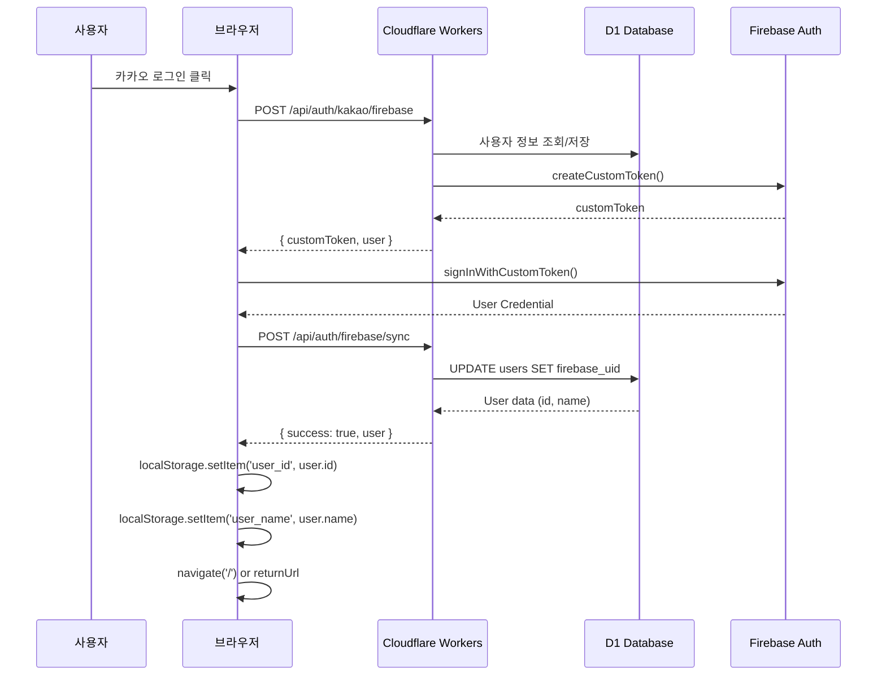

# 카카오 로그인 무한 루프 해결 완료 🎉

## 문제 분석

### 증상
- 카카오 로그인 성공 후 `/user/profile` 페이지로 이동
- `UserProfilePage`가 `userId: null`을 감지하고 `/login`으로 리다이렉트
- 무한 로그인 루프 발생

### 근본 원인
```typescript
// UserProfilePage.tsx
const userId = getUserId()  // localStorage.getItem('user_id') 반환

// utils/auth.ts
export function getUserId(): string | null {
  return localStorage.getItem('user_id') || 
         localStorage.getItem('userId')  // 레거시 키
}
```

**문제**: AuthContext의 D1 sync 성공 후 `user_id`, `user_name`을 localStorage에 저장하지 않음

### 로그 분석
```javascript
// ✅ D1 동기화는 성공
[AuthContext] ✅ D1 동기화 완료

// ❌ 하지만 localStorage에는 저장되지 않음
localStorage.getItem('user_id')  // null
localStorage.getItem('user_name')  // null

// ❌ 결과: UserProfilePage가 로그인 필요 판단
userId: null  // getUserId() 반환값
→ navigate('/login')  // 무한 루프
```

## 해결 방법

### 1. AuthContext.tsx 수정
```typescript
// BEFORE
await api.post('/api/auth/firebase/sync', { ... })
localStorage.setItem(lastSyncKey, now.toString())
console.log('[AuthContext] ✅ D1 동기화 완료')

// AFTER
const syncResponse = await api.post('/api/auth/firebase/sync', { ... })

// ✅ D1 sync 성공 시 user_id, user_name을 localStorage에 저장
if (syncResponse.data?.success && syncResponse.data?.user) {
  const userData = syncResponse.data.user
  localStorage.setItem('user_id', userData.id?.toString() || '')
  localStorage.setItem('user_name', userData.name || '')
  
  console.log('[AuthContext] ✅ D1 동기화 완료 + localStorage 저장:', {
    userId: userData.id,
    userName: userData.name
  })
}
```

### 2. 백엔드 /api/auth/firebase/sync 응답 구조
```typescript
// 성공 응답
{
  success: true,
  user: {
    id: 123,           // D1 users 테이블의 id
    email: "user@example.com",
    name: "사용자이름"
  }
}
```

## 배포 정보

### Git Commit
```bash
Commit: cf76f47
Message: fix: 🐛 AuthContext에서 D1 sync 후 user_id, user_name을 localStorage에 저장
Branch: main
Push: ✅ 성공
```

### Cloudflare Deployment
```
Project: ur-live
Status: ✅ 배포 완료
URL: https://live.ur-team.com
```

### Firebase 환경변수 확인
```
✅ FIREBASE_PRIVATE_KEY: 1703 chars
✅ FIREBASE_CLIENT_EMAIL: firebase-adminsdk-fbsvc@urteam-live-commerce-5b284.iam.gserviceaccount.com
✅ FIREBASE_PROJECT_ID: urteam-live-commerce-5b284
✅ FIREBASE_DATABASE_URL: https://urteam-live-commerce-5b284-default-rtdb.firebaseio.com
```

## 테스트 절차

### 1. 브라우저에서 테스트
1. **완전 캐시 삭제** (중요!)
   - Chrome: `Shift + F5` 또는 개발자도구 → Network → "Disable cache" 체크 → 새로고침
   - 또는 `localStorage.clear()` 실행

2. **카카오 로그인 테스트**
   ```
   https://live.ur-team.com/login
   → 카카오 로그인 버튼 클릭
   → 카카오 계정 인증
   → 홈 또는 프로필 페이지로 자동 이동
   ```

3. **예상 로그 (F12 Console)**
   ```javascript
   [Firebase 초기화] ✅ Firebase 초기화 완료
   [Firebase Auth 초기화] ✅ Firebase Auth 초기화 완료
   [AuthContext] 🔥 Firebase Custom Token 로그인 시작
   [AuthContext] ✅ Firebase 로그인 성공: kakao_4735311250
   [AuthContext] ✅ D1 동기화 완료 + localStorage 저장: { userId: 123, userName: "사용자이름" }
   [AuthContext] ✅ 로그인 상태 확정: { uid: "kakao_4735311250", role: "user" }
   ```

4. **localStorage 확인**
   ```javascript
   localStorage.getItem('user_id')        // "123" (숫자 ID)
   localStorage.getItem('user_name')      // "사용자이름"
   localStorage.getItem('firebase_token') // "eyJhbGciOiJSUzI1..."
   localStorage.getItem('user_type')      // "user"
   ```

5. **UserProfilePage 정상 작동 확인**
   - URL: `https://live.ur-team.com/user/profile`
   - 무한 루프 없음
   - 사용자 정보 표시됨

### 2. 로그인 플로우 전체 확인



## 예상 동작

### 성공 시나리오
1. ✅ 카카오 로그인 버튼 클릭
2. ✅ 카카오 OAuth 인증
3. ✅ Firebase Custom Token 발급
4. ✅ Firebase Auth 로그인
5. ✅ D1 sync + localStorage 저장 (`user_id`, `user_name`)
6. ✅ 홈 또는 프로필 페이지로 자동 이동
7. ✅ 무한 루프 없음

### 실패 시나리오 (디버깅)
만약 여전히 문제가 발생하면:

1. **콘솔 로그 확인**
   ```javascript
   // localStorage 저장 확인
   localStorage.getItem('user_id')  // null이면 sync 실패
   ```

2. **D1 sync 에러 확인**
   ```javascript
   [AuthContext] ❌ D1 동기화 실패: { ... }
   ```

3. **Firebase Token 검증 실패**
   ```javascript
   [Firebase Sync] ❌ Token validation failed
   ```

## 관련 파일

- `src/contexts/AuthContext.tsx` - 로그인 상태 관리 (수정됨)
- `src/utils/auth.ts` - localStorage 유틸리티
- `src/pages/UserProfilePage.tsx` - 프로필 페이지
- `src/index.tsx` - 백엔드 API (`/api/auth/firebase/sync`)

## 추가 개선 사항

### 완료된 항목
- ✅ Firebase 환경변수 추가 (FIREBASE_PROJECT_ID, FIREBASE_DATABASE_URL)
- ✅ D1 sync 후 localStorage 저장 로직 추가
- ✅ 환경변수 검증 엔드포인트 (`/api/test/env`)

### 향후 개선 (선택사항)
- [ ] D1 sync 실패 시 재시도 로직
- [ ] localStorage 대신 IndexedDB 사용 (용량 제한 해결)
- [ ] UserProfilePage에서 Firebase User로 직접 사용자 정보 조회

## 연락처

문제가 지속되면 다음 정보를 포함하여 문의:
1. 브라우저 콘솔 로그 전체 (F12)
2. `localStorage.getItem('user_id')` 값
3. `/api/test/env` 결과
4. 카카오 로그인 후 URL (에러 파라미터 포함)

---

**배포 완료**: 2026-03-01 14:42 UTC  
**커밋**: cf76f47  
**상태**: ✅ 프로덕션 배포 완료
