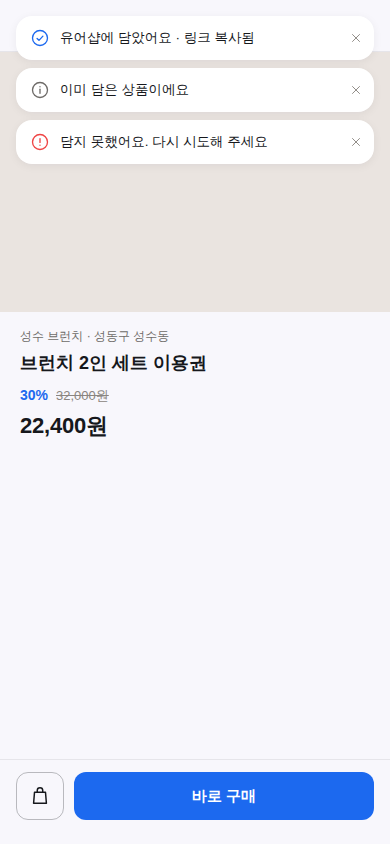
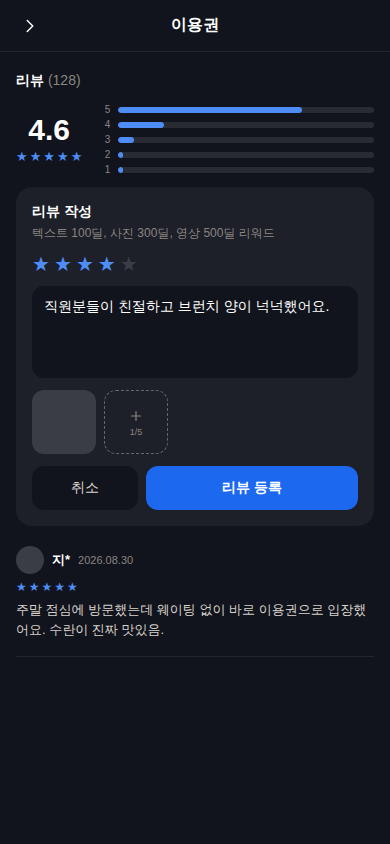
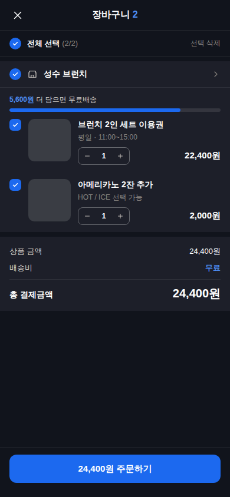
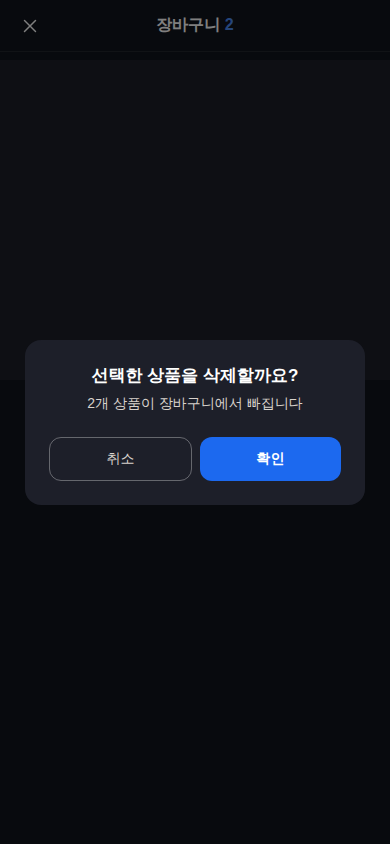

# 소비자 팝업·입력창 시안 — 담기 토스트 · 리뷰 작성란 · 장바구니 (2026-09-02)

**시안 캔버스**: https://claude.ai/code/artifact/1a44e272-aba0-4c9d-b44f-fc9a742c228a (아홉 장, 라이트/다크)
**근거 시스템**: 코레일톡 디자인 시스템 (`docs/design/ticket-completion-reference-2026-09.md`, CLAUDE.md 🎫 절)
**구현**: PR #1313 (`claude/pin-add-error-popup-design-8ltmpp`) — 시안과 구현이 같은 세션에서 나왔다.
**배경**: 대표 신고 3건 — "핀 추가 중 오류" 오진 + 긴 문구 · 리뷰 작성란 다크에서 흰 글자 · 장바구니 다크에서 화면 절반 회색.
대표 *"너가 시안을 보내줘봐"* 로 세션이 그렸다(대표 시안 아님 — 승인 대기).

## 렌더 (Chromium 390px)
| 담기 토스트 · 라이트 | 리뷰 작성 · 다크 | 장바구니 · 다크 | 삭제 확인 · 다크 |
|---|---|---|---|
|  |  |  |  |

## 결정 사항 (시안 = 구현)
| 표면 | 종전 | 시안 |
|---|---|---|
| 토스트 | 잉크 상자 `#18181B` + 링 + 무거운 그림자, 초록/하늘 아이콘, 이모지 + 예상 적립 시뮬레이터 | 라이트 흰 카드 + `shadow-lift` / 다크 `#1D1F29`, 테두리 0. 아이콘 하나: 성공·안내 = 브랜드 글자색, 오류만 빨강. 문구 30자 이내 · 이모지 0 · "핀"→"담기" |
| 리뷰 작성 | 카드 테두리, 핑크 정보상자 + 🎁, 노란 별, 검정 버튼, textarea 다크 배경 없음 | 카드 테두리 0 + lift, 입력면은 카드보다 한 톤 낮은 바탕색(`#F8F7FC` / `#11141C`), 회색 한 줄 안내, 별·등록 버튼 브랜드 |
| 장바구니 | 래퍼 `#F4F4F4` 단독, 핑크 체크박스, `#f9fafb` 정보상자 | 바탕 두 톤 + surface 카드, 브랜드 체크박스, 정보상자 없이 숫자만 강조 |
| 삭제 확인 모달 | 초록 체크 원 / 파란 i, 검정 버튼, `z-50` | 아이콘 0(규칙 ⑥), 제목·본문·버튼 둘, 주 버튼 브랜드, `Z.MODAL_BACKDROP` |

## 열린 선택 (대표 판단)
- **토스트 위치**: 현재 상단 중앙(Main). 캔버스의 *Option B* 는 하단 CTA 위 스낵바 — 엄지에 가깝고 상단을 안 가리지만 CTA 와 겹쳐 보일 수 있다.

## ✅ 구현 완료
PR #1313 — 시안 아홉 장 중 Main 방향 그대로. Option B 는 미채택(대표 선택 시 `ToastContainer.tsx` 위치 클래스 1줄).
