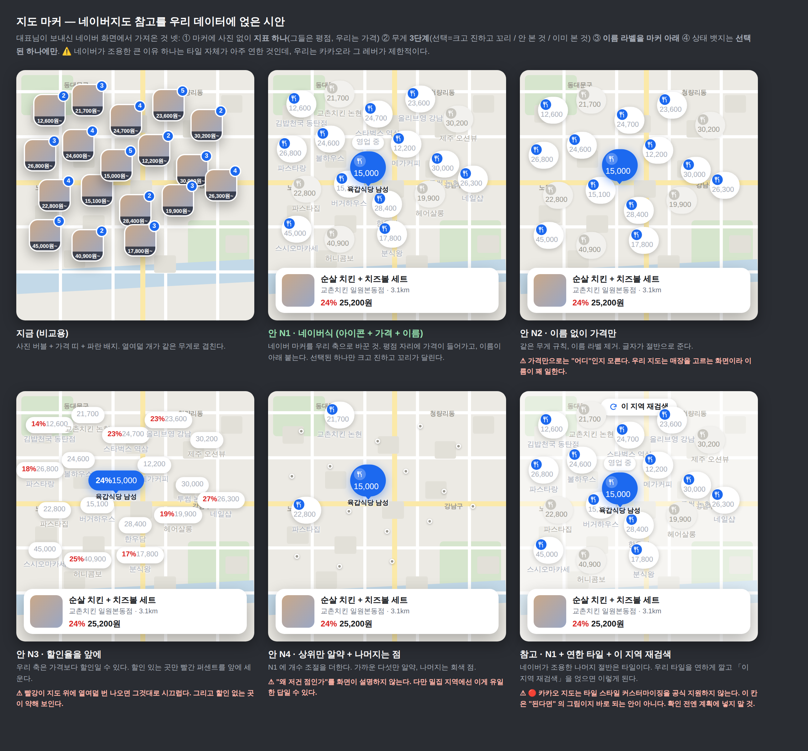
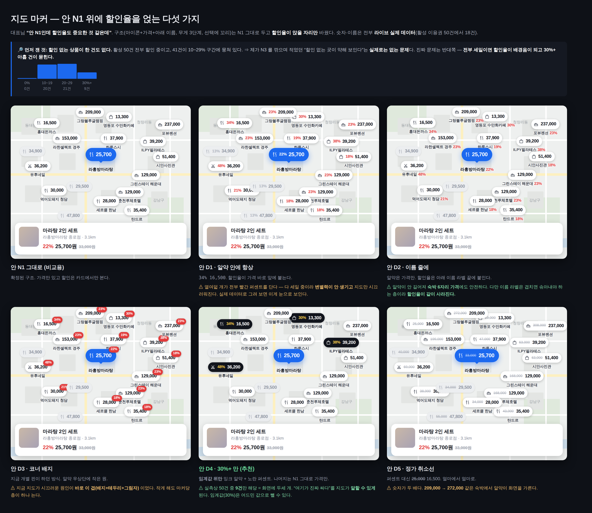
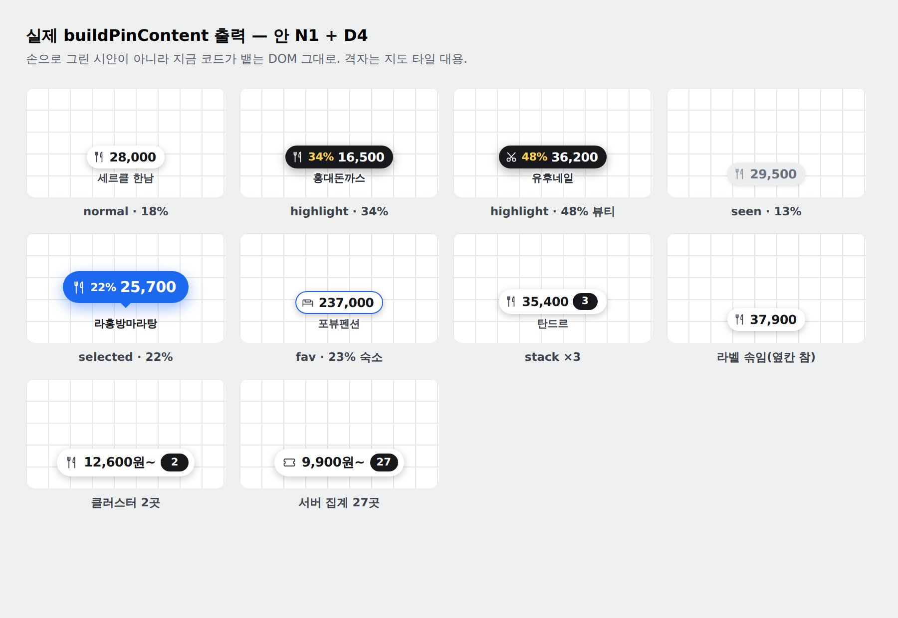
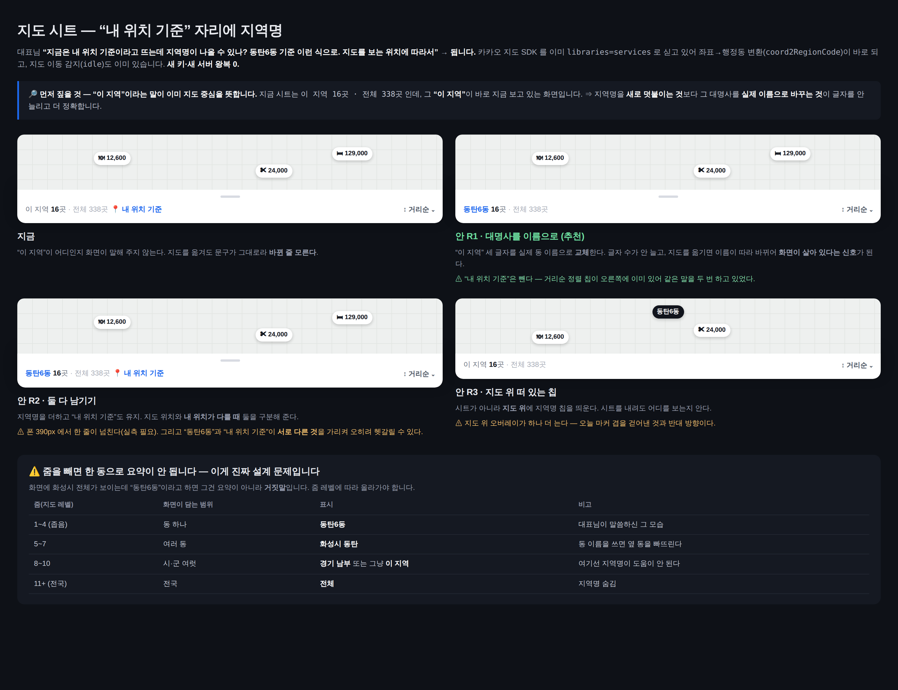

# 지도 마커 정리 — 시안 6안 (2026-09-09)

대표: *"지도 페이지 너무 정신없어. 여기도 시안들 받아보고 싶어."* (지도 화면 캡처와 함께)

시안 이미지: `assets/map-marker-declutter-2026-09.png` (같은 18개 위치·같은 데이터로 6안)

## 무엇이 정신없게 만드는가 (소스 실측)

`src/pages/restaurant-map/map-overlays.ts` 를 읽어 마커 하나의 해부를 셌다.

**클러스터 버블**(`bubbleHtml`, 64×64):
사진 + 흰 테두리 2.5px + 그림자 + 가격 띠(검정 72% 스크림) + 파란 카운트 배지
(그 배지도 **자기 흰 테두리 2px 와 자기 그림자**를 갖는다)

**개별 핀**(`buildPinContent`, 42px):
사진 원형 + 잉크 링 3px + 흰 테두리 2px + 그림자 + 모서리 배지(할인율/라이브/찜/`+N`)

⇒ **정보 3개(사진·가격·개수)에 장식 4겹.** 그게 한 화면에 스무 개 넘게 겹치고,
그 밑은 카카오 타일(도로·지명·POI 아이콘이 이미 가득한 컬러 배경)이다.

🔑 **문제는 "예쁘지 않다"가 아니라 "셋 다 동시에 말해서 하나도 안 읽힌다"** 이다.
가격을 비교하려면 사진이 방해하고, 사진을 보려면 배지가 방해한다.

## 안

| 안 | 무엇 | 대가 |
|---|---|---|
| 지금 | 사진 버블 + 가격 띠 + 파란 배지 | 셋이 서로를 가린다 |
| **안 1 · 가격만** | 사진을 빼고 가격 알약 하나 | 사진으로 고르던 사람은 아쉽다(선택하면 아래 카드에서 본다) |
| 안 2 · 점 + 카드 | 점만, 누르면 카드 | 가장 조용하지만 **훑어보기를 잃는다**. 눌러 보기 전엔 비싼지 싼지 모른다 |
| 안 3 · 장식만 제거 | 사진 유지, 테두리·그림자·배지 제거, 34px | 여전히 사진 열여덟 장이 겹친다. **개수 문제가 안 풀린다** |
| 안 4 · 상위만 알약 | 다섯 곳만 가격, 나머지는 점 | "왜 저건 점이고 이건 알약인가"를 화면이 설명하지 않는다 |
| **⭐ 안 5 · 알약 + 본 것 흐리게 + 선택 강조** | 안 1 에 두 가지를 더한다 | 방문 이력을 기억해야 한다(localStorage) |

## 추천 — 안 5

안 1(가격 알약)을 바탕으로 **무게를 세 단계로 나눈다**:

| 상태 | 생김새 | 뜻 |
|---|---|---|
| 선택됨 | 파란 알약 + 아래 카드 | 지금 보고 있는 것 |
| 안 본 것 | 흰 알약 + 잉크 글자 | 볼 만한 것 |
| 이미 본 것 | 회색 알약 + 흐린 글자 | 지나간 것 |

열여덟 개가 **같은 무게로 동시에 소리치지 않게** 되는 것이 요점이다. 정신없음의 뿌리는
개수가 아니라 **모두가 똑같이 중요하다고 주장하는 것**이다.

### 왜 가격을 남기는가

지도에서 사람이 실제로 비교하는 축은 가격이다(네이버지도 숙박·에어비앤비가 전부 이 형태).
사진은 "무엇인지"를 말하지만 열여덟 장이 겹치면 아무것도 말하지 않는다. 사진은
**선택한 하나**에서 카드로 크게 보여 주는 편이 낫다.

### 무엇이 사라지는가 (솔직히)

- **파란 카운트 배지**: 클러스터에서 "몇 곳"인지. 알약 안에 `12,600~ 4곳` 으로 흡수 가능하나
  글자가 길어진다. 별도 판단 필요.
- **할인율 배지**: 지금 개별 핀 모서리의 `-23%`. 카드에서 본다.

## ⚠️ 이 시안이 안 건드리는 것

- **핀 개수를 줄이지 않는다.** 화면에 몇 개를 띄울지는 별개 문제이고, 2026-09-03 수요 로딩
  이후 화면은 가까운 50개만 갖고 있다(그 이상은 서버가 안 준다).
- **카카오 타일 자체.** 타일을 어둡게 깔면(스크림) 마커가 더 뜨지만, 09-02 대표 확정
  *"지도 위 UI 는 테마를 따르지 않는다(타일이 밝다)"* 와 충돌할 수 있어 뺐다.
- **상단 필터 줄·바텀시트.** 캡처에 같이 있지만 이번 시안의 범위 밖이다.

## ⏳ 구현 대기

대표 선택 후 진행. 선택 전에는 코드 변경 없음.

---

## 🗾 2026-09-09 추가 — 네이버지도 참고 (대표 *"이것도 참고해볼래? 지도 말이야"*)



대표가 보낸 네이버지도 화면에서 **가져올 수 있는 것 넷**을 먼저 뽑았다. 그 화면이 조용한 이유는
마커가 적어서가 아니라(네이버도 스무 개 가까이 떠 있다) **마커 하나가 한 가지만 말하기** 때문이다.

1. **마커에 사진이 없다.** 아이콘(업종) + 숫자 하나. 네이버는 그 숫자가 평점이고, **우리는 가격**이다.
2. **무게가 3단계다.** 선택된 것 = 크고 진하고 **꼬리가 달린다** / 안 본 것 = 흰 알약 / 이미 본 것 = 회색.
   지금 우리 지도는 열여덟 개가 **전부 같은 무게**라 그게 정신없음의 실체다.
3. **이름 라벨이 마커 아래**에 따로 붙는다(마커 안이 아니라). 그래서 마커는 작게 유지된다.
4. **상태 뱃지(영업 중)는 선택된 하나에만.**

### 5안

| 안 | 내용 | 판단 |
|---|---|---|
| **N1 · 네이버식** | 아이콘 + 가격 + **이름 아래 라벨**, 무게 3단계, 선택에 꼬리 | ⭐ 추천 |
| N2 · 가격만 | N1 에서 이름 라벨 제거 | 글자가 절반. 다만 **"어디"인지 모른다** — 우리 지도는 매장을 고르는 화면이라 이름이 꽤 일한다 |
| N3 · 할인율 앞에 | `24% 15,000` — 우리 축은 가격보다 할인일 수 있다 | 빨강이 열여덟 번 나오면 그것대로 시끄럽고, **할인 없는 곳이 약해 보인다** |
| N4 · 상위만 알약 + 나머지 점 | 가까운 다섯만 알약, 나머지는 회색 점 | *"왜 저건 점인가"* 를 화면이 설명 못 한다. 밀집 지역에선 이게 유일한 답일 수 있다 |
| 참고 · N1 + 연한 타일 + 이 지역 재검색 | 네이버가 조용한 **나머지 절반은 타일**이다 | 🔴 **카카오는 타일 스타일 커스터마이징을 공식 지원하지 않는다.** "된다면"의 그림이지 바로 되는 안이 아님 |

### 추천 = **안 N1**

네이버의 구조를 그대로 쓰되 그들의 평점 자리에 **우리 가격**을 넣는다. 사진을 마커에서 빼고
**선택한 하나의 카드**로 옮기면, 지금 마커마다 겹쳐 있는 [사진 + 흰 테두리 + 그림자 + 가격 띠 +
파란 배지 + 배지의 흰 테두리 + 배지의 그림자] 7겹이 [아이콘 + 숫자] 2겹이 된다.

### ⚠️ N1 을 하기 전에 풀어야 하는 것 (시안에서도 보인다)

- **이름 라벨이 이웃 마커를 침범한다.** 시안 가운데 위쪽에서 `15, 육갑식당 남성` 처럼 겹친 자리가
  실제로 있다. 네이버는 **줌 레벨별로 라벨을 솎아낸다**(가까운 것만 이름을 준다). 우리도 같은
  규칙이 필요하고, 그게 N1 의 실제 구현 비용 대부분이다. 규칙 없이 붙이면 지금보다 더 어지럽다.
- **파란 카운트 배지의 행방.** 클러스터의 "몇 곳"은 알약 안에 흡수하든(`12,600~ 4곳`) 줌인 유도로
  대체하든 정해야 한다.

### ⏳ 여전히 코드 변경 없음

대표가 N1~N4 중 하나를 고르면 착수한다.

---

## 💸 2026-09-09 추가 — N1 위에 할인율 (대표 *"안 N1인데 할인율도 중요한 것 같은데"*)



구조(아이콘 + 가격 + 아래 이름, 무게 3단계, 선택에 꼬리)는 N1 그대로 두고 **할인율이 앉을 자리만**
바꿨다. 숫자·상호는 전부 **라이브 실제 데이터**(활성 이용권 50건 중 18건).

### 🔎 먼저 잰 것 — 할인 없는 상품이 한 건도 없다

| 할인율 | 0% | 10~19% | 20~29% | 30%+ |
|---|---|---|---|---|
| 건수(활성 50) | **0** | 20 | 21 | 9 |

⇒ 09-09 오전에 내가 N3 를 깎으며 적은 *"할인 없는 곳이 약해 보인다"* 는 **실제로는 없는 문제**다
(그 문장은 재보지 않고 쓴 추측이었다). 진짜 문제는 반대쪽이다 — **전부 세일 중이면 할인율이
배경음이 되고, 정작 눈에 띄어야 할 30%+ 아홉 건이 묻힌다.**

### 다섯 안

| 안 | 자리 | 판단 |
|---|---|---|
| D1 · 알약 안에 항상 | `34% 16,500` | 열여덟 개가 전부 빨간 퍼센트를 단다. 다 세일이라 **변별력이 안 생기고** 지도만 시끄럽다 |
| D2 · 이름 줄에 | `홍대돈까스 34%` | 알약이 안 길어져 **숙박 6자리**(209,000)에 안전. 다만 이름 라벨은 겹치면 솎아내는 층이라 **할인율이 같이 사라진다** |
| D3 · 코너 배지 | 알약 우상단 작은 원 | 지금 지도가 시끄러운 원인이 **바로 이 겹**(배지 + 테두리 + 그림자)이었다. 작게 해도 마커당 층이 하나 는다 |
| **D4 · 30%+ 만** | 임계값 위만 잉크 알약 + 노란 퍼센트 | ⭐ 추천 |
| D5 · 정가 취소선 | ~~25,000~~ 16,500 | 숫자가 두 배. `272,000 → 209,000` 같은 숙박에서 알약이 화면을 가른다 |

### 추천 = **안 D4**

할인율을 **전부 띄우는 대신 임계값 위만** 다른 무게로 띄운다. 실측상 50건 중 **9건**만 해당하므로
화면에는 두세 개가 뜬다. 그러면 지도가 *"여기 다 세일 중"* 이 아니라 **"여기가 진짜 싸다"** 를
말할 수 있다. 나머지는 N1 그대로 가격만 — 마커 층이 안 늘어난다.

- 임계값(30%)은 **어드민 값**으로 빼는 게 맞다(라인업이 바뀌면 기준도 바뀐다). 코드에 박지 말 것.
- **이미 본 것(회색)은 강조 대상에서 제외**한다 — 3단계 무게가 할인 강조를 이겨야 순서가 안 꼬인다.
- 할인율 전체는 여전히 **선택한 하나의 카드**에서 정확히 보인다(`22% 25,700원 ~~33,000원~~`).

## ✅ 구현 완료 — 안 D4 (2026-09-09 대표 확정 "안 D4로 하자")



⚠️ 위 그림은 **시안이 아니라 `buildPinContent` 가 실제로 뱉는 DOM** 이다(카카오 SDK 는 유닛에서 못
띄우므로 마커 DOM 만 뽑아 브라우저로 렌더). 손그림과 배포물이 갈리는 것을 막으려고 이렇게 남긴다.

### 무엇이 바뀌었나

| | 이전 | 지금 |
|---|---|---|
| 개별 핀 | 사진 원 + 링 + 흰 테두리 + 그림자 + 모서리 배지(+배지 테두리·그림자) = **7겹** | `[아이콘] (할인율) 가격` **알약 한 겹** + 아래 이름 |
| 클러스터 | 사진 버블 + 가격 띠 + 떠 있는 파란 카운트 배지 | 알약 + **안쪽** 잉크 카운트 칩 |
| 무게 | 열여덟 개가 전부 같음 | **3단계** — 선택(브랜드 면 + 꼬리) / 이미 본 것(회색) / 그 외 |
| 할인율 | 모서리 배지에 항상 | **30%+ 만** 잉크 알약 + 노란 퍼센트 |
| 앵커 | `yAnchor 0.5`(좌표 위에 얹힘) | `yAnchor 1`(바닥이 좌표를 가리킨다 — 꼬리의 전제) |

### 배지가 나르던 정보는 버리지 않았다

- **즐겨찾기 ❤** → 알약 자신의 **브랜드 윤곽선**(선택은 면, 즐겨찾기는 선).
- **같은 좌표 +N** → 클러스터와 **같은 장치**(알약 안 칩).
- **라이브 ●** → 제거. `liveSellerIds` 는 라이브커머스 영구중단 이후 **항상 빈 Set** 이라 한 번도 뜬 적이 없는 죽은 코드였다. 그 prop 도 같이 걷어냈다.

### 이름 라벨 겹침을 어떻게 풀었나

시안에서 지적한 N1 의 실제 비용이 여기였다. 네이버는 줌 레벨별로 라벨을 솎아내는데, 우리는
**이미 있는 격자 클러스터링**을 그대로 쓴다 — 개별 핀은 정의상 자기 칸에 혼자이므로(둘 이상이면
버블로 접힌다) 남은 위험은 옆 칸뿐이고, **8-이웃이 비었을 때만** 이름을 준다.

### 곁다리로 드러난 것 둘 (고쳤다)

1. **`discount_percent` 는 선언만 되고 한 번도 채워진 적이 없었다.** 서버가 보내는 이름은
   `discount_rate` 다. 그래서 지도만 자체 계산식을 써서 **할인율 정의가 셋으로 갈려 있었다**
   (서버 정렬 `MAX(discount_rate, 계산값)` · 카드 `priceDisplay` · 지도 자체 계산).
   D4 의 임계값이 카드와 다른 집합을 고르면 안 되므로 `priceDisplay` 로 통일했다.
2. **`seen` 라벨을 `visibility:hidden` 으로 감췄더니 그 핀만 위로 떴다** — visibility 는 자리를
   차지하고 앵커가 바닥이라, 이미 본 핀이 엉뚱한 좌표를 가리켰다. `display` 로 교체.
   실제 출력을 렌더해 보고서야 발견했다(코드만 읽어서는 안 보인다).

### 임계값 30% 는 아직 상수다 (정직하게)

`MAP_HIGHLIGHT_DISCOUNT_PCT`(`src/shared/map-marker.ts`). **어드민 값이 아니다** — 지도는 오늘
설정을 받아오지 않고, 숫자 하나 때문에 왕복을 하나 더 만드는 것은 이 레포의 로딩 규칙에 어긋난다.
소비자 설정 채널이 생기면 `platform_settings` 로 옮길 자리이고, 그 전까지는 라인업이 크게 바뀌면
이 상수를 같이 고쳐야 한다.

### 가드

`src/tests/unit/map-marker-d4.test.ts` 23건 + 주입 매니페스트 7건(**전부 빨간불 확인**).
`map-chips-b.test.ts` 의 "핀 링" 검사는 구조가 바뀌어 **지우지 않고 재조준**했다 — 지키던 것은
변수 이름이 아니라 *"강조색은 브랜드 하나, 자리는 선택뿐"* 이라는 규칙이다.

⚠️ **가드가 못 막는 것**: 카카오 타일 위에서의 실제 겹침·가독성. 마커는 CustomOverlay 라 유닛에서
지도를 못 띄운다. **배포 후 눈으로 볼 것** — 특히 상호가 긴 매장(9자에서 자른다)과 숙박 6자리 가격.

검증: tsc 0 · build 0 · vitest 632파일 7,707건 pass · file-size 통과.

---

## 📍 2026-09-09 추가 — 시트의 "내 위치 기준" 자리에 지역명 (대표 질문)

대표: *"지금은 내 위치 기준이라고 뜨는데 지역명이 나올 수 있나? 예를 들어서 동탄 6동 기준 이런 식으로?
지도를 보는 위치에 따라서 말이지?"*



### 결론: 된다. 새 키도 새 왕복도 없다

- 카카오 지도 SDK 를 이미 `libraries=services` 로 싣는다(`src/lib/kakao-sdk.ts`) → `Geocoder.coord2RegionCode`
  로 좌표→행정동이 **클라에서 바로** 나온다. 서버 왕복 0.
- 지도 이동 감지도 이미 있다 — `useKakaoMap` 의 `idle` 리스너(뷰포트 컬링용). 거기 얹으면 된다.
- ⚠️ `idle` 마다 부르면 팬할 때마다 호출된다 → **디바운스 필요**(그리고 같은 동이면 재호출 스킵).

### 🔎 먼저 짚은 것 — "이 지역"이 이미 지도 중심을 뜻한다

지금 문구는 `이 지역 16곳 · 전체 338곳 📍내 위치 기준` 인데, 그 **"이 지역"이 바로 지금 보는 화면**이다.
⇒ 지역명을 *덧붙이는* 것보다 **그 대명사를 실제 이름으로 바꾸는 것**이 글자를 안 늘리고 더 정확하다.

| 안 | 문구 | 판단 |
|---|---|---|
| **R1 · 대명사를 이름으로** | `동탄6동 16곳 · 전체 338곳` | ⭐ 추천. "내 위치 기준"은 뺀다 — 오른쪽 거리순 칩이 이미 같은 말을 한다 |
| R2 · 둘 다 | `동탄6동 16곳 · 전체 338곳 📍내 위치 기준` | 폰 390px 에서 한 줄이 넘칠 수 있고, 두 문구가 **서로 다른 것**(보는 곳 ↔ 내가 선 곳)을 가리켜 오히려 헷갈린다 |
| R3 · 지도 위 칩 | 지도 상단에 떠 있는 `동탄6동` | 시트를 내려도 보이지만 **지도 위 오버레이가 하나 는다** — 안 D4 로 겹을 걷어낸 것과 반대 방향 |

### ⚠️ 진짜 설계 문제는 줌이다

화면에 화성시 전체가 보이는데 "동탄6동"이라고 하면 요약이 아니라 **거짓말**이다.

| 줌(지도 레벨) | 화면이 담는 범위 | 표시 |
|---|---|---|
| 1~4 | 동 하나 | `동탄6동` |
| 5~7 | 여러 동 | `화성시 동탄` |
| 8~10 | 시·군 여럿 | `경기 남부` 또는 그냥 `이 지역` |
| 11+ | 전국 | `전체`(지역명 숨김) |

`coord2RegionCode` 는 **한 점**의 행정동만 준다 — 화면이 넓으면 그 점의 동은 화면을 대표하지 못한다.
그래서 줌 레벨을 함께 봐야 하고, 그게 이 기능의 실제 구현 비용이다.

### ✅ 구현 완료 — 안 R1 (2026-09-09 대표 확정 "안 R1로 할게")

실제 렌더(jsdom, 폰 폭 기준):

```
동탄6동 16곳 · 전체 338곳                         가까운 순
```

폴백(지오코딩 실패·전국 줌·지도 밖):

```
이 지역 16곳 · 전체 338곳                         할인율 순
```

- **SSOT** `src/shared/map-region-label.ts` — 레벨 → 행정 단위 표 + 재조회 판정. 규칙이 한 곳에 있다.
- **훅** `src/pages/restaurant-map/useViewportRegion.ts` — 기존 `idle` 에 얹고 450ms 디바운스.
  서버 왕복 0(카카오 SDK 의 `Geocoder.coord2RegionCode`, `libraries=services` 는 이미 싣고 있다).
- **시트** `SheetFilterBar` 는 `regionLabel` 이 있으면 그것을, 없으면 종전 "이 지역"을 쓴다.
  `📍내 위치 기준` 은 뺐다 — 오른쪽 정렬 칩이 이미 같은 말을 한다.

#### ⚠️ 위 표에서 **한 칸 바꿨다** (5~7 `화성시 동탄`)

시안 표는 5~7 을 `화성시 동탄` 으로 적었는데 **그렇게 안 만들었다.** 그 이름은 API 가 주지 않아
`동탄6동` 에서 숫자를 떼어 지어내야 하는데, 그 처방이 `신사동 → 신사`(시가 아니라 동네 이름이
통째로 잘림)처럼 **틀린 이름을 만든다.** 지어내느니 한 단계 위 실제 이름을 쓴다:

| 카카오 레벨 | 표시 | 근거 |
|---|---|---|
| ~6 | `동탄6동` (행정동) | 축척 500m — 화면이 동 하나 |
| 7~8 | `화성시` (시군구) | 축척 1~2km — 여러 동 |
| 9~10 | `경기` (시도) | 축척 4~8km — 시·군 여럿 |
| 11~ | (이름 없음 → "이 지역") | 한 점의 시도가 전국 화면을 대표하지 못한다 |

⚠️ 레벨 9 부터는 서버 집계 모드(`AGG_LEVEL`)라 시트가 대개 "이 지역" 갈래로 안 간다 —
9~10 규칙은 집계가 비었을 때의 안전망이다.

가드: `src/tests/unit/map-region-label.test.ts` 18건 + 주입 매니페스트 10건(전부 되돌려-검증 빨간불).
**가드가 못 보는 것**: 카카오가 실제로 돌려주는 이름. 표의 매핑이 옳은지는 라이브에서 눈으로 봐야 한다.
