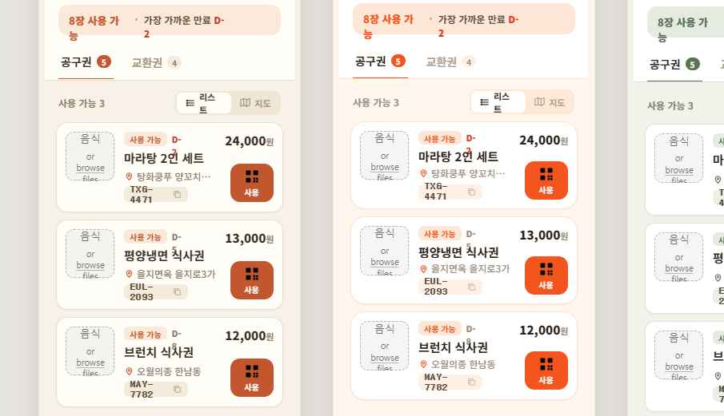

# 🎟️ 내 지갑 (선결제 식사권 지갑) — 흑백 iOS-클린 리디자인

- **대상 페이지**: `/my-vouchers` (`src/pages/MyVouchersPage.tsx`)
- **시안 받은 날**: 2026-06-20
- **출처**: Claude Design (claude.ai/design) handoff bundle (`478b54e2-…handoff.zip`)
- **상태**: ✅ 구현 완료 (단일 페이지 톤 리파인 — 지도/설정 전용 화면은 보류)
- **프로토타입(SSOT)**: [`my-vouchers-wallet-bw.dc.html`](./my-vouchers-wallet-bw.dc.html) — 픽셀/색상/간격은 이 파일이 진실원천
- **톤 탐색본(참고)**: [`my-vouchers-wallet-tone-explore.dc.html`](./my-vouchers-wallet-tone-explore.dc.html) — 따뜻한 크라프트 톤 3종(장날/동네 한바퀴/단골). **채택 안 됨** — 사용자는 흑백본을 최종으로 선택.
- **스크린샷**: 

> 배경: 2026-06-20 사용자 신고 "공구권 페이지 디자인이 심각해 … 너무 성의없어"(코드 주석에 기록됨)의 후속.
> 사용자가 직접 모킹한 정식 리디자인. → **구현 의도 명확**(단, 6개 화면 중 어디까지/한 번에 vs 단계적 인지 확인 필요).

---

## 디자인 컨셉

**순수 흑백 + 최소 기능색.** 잉크(`#0A0A0A`) 타이포 + 화이트 카드, 기능색은 상태 점/배지에만:
- 🟢 사용 가능 점 `#16A34A`
- 🔴 임박/실패 `#DC2626` (D-2, 발송 실패)
- 보조 텍스트 `#6B7280` / `#9CA3AF`, 헤어라인 `rgba(0,0,0,0.07~0.08)`
- 트랙/칩 배경 `#F5F6F8`
- **블랙 필(pill) CTA** — `#0A0A0A` 배경 + 흰 글자 (사용/등록/바코드 버튼)
- 폰트: **Pretendard** (이미 프로젝트에서 사용), 큰 타이틀 `800 30px`, letter-spacing `-0.03em`
- 코드/가격은 `ui-monospace` (SFMono/Menlo)

> ⚠️ 현재 디자인 토큰(`walletTokens.light.accent = #EC4899` 핑크)과 **상충**.
> 빈 상태 CTA·일러스트가 핑크-레드 그라데이션 → 시안은 잉크 블랙. 이 부분이 가장 큰 시각 변경.
> (`/my-vouchers` 는 화이트 테마 + 다크 토글 지원 — 잉크 톤은 라이트에서 OK, 다크 매핑 동반 필요.)

---

## 화면 6종

| # | 화면 | 핵심 |
|---|---|---|
| 1 | **메인 · 공구권** | "내 지갑"(800/30) + 상태줄(🟢 8장 사용 가능 · 가장 가까운 만료 D-2). 공구권/교환권 세그먼트. "사용 가능 N" + 지도 토글. 식사권 카드 리스트. 하단 "사용 완료 N / 만료·환불 N" 헤어라인 박스(접힘 행). |
| 2 | **지도** | "지도에서 보기" 헤더. 추상 맵 + 핀(가게명·D-N 라벨). 우상단 현위치 버튼. 하단 카드(썸네일+가게·거리·도보분+블랙 사용 버튼). |
| 3 | **사용 모달** | 바텀시트(상단 다크 status bar 영역). 상품명(800/21)+가게 핀. QR(176px). 코드 칩+복사. 🟢 실시간 `오후 hh:mm:ss`(pulse). "이미 결제 완료된 식사권이에요" 안내. "매장 안내" 칩+시간. **공유 / 구매 취소·환불** 2버튼. "미사용·7일 이내 환불" 안내. |
| 4 | **메인 · 교환권** | 세그먼트 교환권 활성. 전화번호 등록 배너(인라인). 브랜드 카드(로고+상품+브랜드명+**바코드** 인라인 + 가격 + 블랙 "바코드" 버튼). 발송 실패 카드(🔴 + "재발송" 아웃라인 버튼). |
| 5 | **빈 상태 · 공구권** | 일러스트(124px) + "받아둔 식사권이 없어요" + 1·2·3 스텝(공구 참여→지갑에 식사권→매장 QR) + 블랙 "공구 보러가기" CTA. |
| 6 | **설정 · 교환권 받을 번호** | "교환권 받을 번호" 헤더. 안내 박스(🟢). 휴대폰 번호 입력(잉크 보더 강조 + 커서). 안내문. 블랙 "이 번호로 등록" CTA. |

### 카드 상세 (공구권, 화면 1)
```
┌ [사진 60×60] ─ 🟢 사용 가능  D-2(빨강)            24,000원 ┐
│              마라탕 2인 세트                      [▦ 사용] │  ← 블랙 필
│              📍 탕화쿵푸 양꼬치거리점                      │
│              [TXG-4471 ⧉]  ← F5F6F8 칩 + 복사            │
└──────────────────────────────────────────────────────────┘
```
카드: `border:1px rgba(0,0,0,0.08)`, `radius:16`, `padding:13`, `box-shadow:0 1px 3px rgba(0,0,0,.04)`.

---

## 현재 구현 vs 시안 차이

현재 `MyVouchersPage.tsx` 는 **정보구조(IA)는 이미 거의 일치**. 이번 시안은 주로 **비주얼 톤 + 일부 화면 승격**.

| 영역 | 현재 | 시안 | 작업 |
|---|---|---|---|
| 액센트 색 | 핑크-레드 그라데이션(`#EC4899`/`accentGradient`) — 빈상태 CTA·일러스트 | 잉크 블랙 `#0A0A0A` | 🎨 토큰/CTA 색 교체 (가장 큰 변경) |
| 큰 타이틀 | `LargeTitle` 컴포넌트 | 800/30 `#0A0A0A` letter-spacing -0.03em | 크기/굵기 정합 확인 |
| 상태줄(사용가능·만료) | 있음(텍스트) | 🟢 점 + D-2 빨강 강조 | 점 추가 + 임박 빨강 |
| 공구권/교환권 세그먼트 | ✅ iOS 세그먼트 (giftCount>0 시) | 동일(항상? 시안엔 둘 다 표기) | 거의 동일 |
| 식사권 카드 | ✅ 사진+상태배지+코드칩+QR버튼 | 🟢 상태 점 + 코드 F5F6F8 칩 + 블랙 필 | 점/칩/버튼 톤 정합 |
| 코드 복사 칩 | code 클릭 복사 | 칩 + 복사 아이콘 명시 | 복사 아이콘 표기 |
| 사용완료/만료·환불 | ✅ 접힘 그룹 | 헤어라인 박스 2행(완료 N / 만료·환불 N) | 박스형 정합 |
| QR/사용 모달 | ✅ QRModal(실시간 시계·이미 결제완료·공유·셀프취소) | 바텀시트 + 매장안내 칩 + 2버튼 그리드 | 레이아웃 바텀시트화 + 매장안내 칩 |
| 교환권 카드(KT) | ✅ KtAlphaVoucherCard(바코드/발송실패/재발송) | 동일 톤(amber 칩→흑백, 바코드 인라인) | amber→흑백 톤 |
| 빈 상태 | ✅ 일러스트+3스텝+핑크CTA | 일러스트+1·2·3 원형스텝+블랙CTA | 핑크→블랙, 스텝 원형 번호 |
| 지도 | ✅ VoucherMap inline 토글(lazy) | 전체화면 지도 + 하단 카드 | 전용 화면? or 현 토글 유지 |
| 교환권 받을 번호(설정) | PhoneRegisterModal(인라인 모달) | **전용 풀페이지** | 신규 라우트? or 모달 유지 |

---

## 🔒 잠금/주의 (CLAUDE.md)

- `MyVouchersPage.tsx` 는 **결제잠금 대상 아님**(직접 수정 OK). 단:
  - 🔒 **로딩 최적화 잠금**: `VoucherMap lazy chunk`(Kakao Maps SDK ~150KB) + `qrcode.react lazy` — **유지 필수**(제거 금지).
  - 🔒 `useMyVouchers` `refetchOnMount:'always'` 재사용 — 별도 fetch 금지.
  - 🔒 voucher 발급 후 `useInvalidateMyVouchers()` 호출 패턴 유지.
- 테마: `/my-vouchers` = 화이트 테마 + 다크 토글 → 모든 라이트 토큰에 `dark:` variant 동반(`check-theme-consistency.mjs`).
- 명칭 SSOT: 사용자-가시 문구는 "공구권/교환권/식사권" 유지(OK). 사람 지칭 금지어 없음.
- 결제/환불 동작(셀프 취소 `/api/group-buy/voucher/:code/cancel`, status 폴링)은 **동작 보존** — 시각만.

---

## 구현 todo

- [x] 색 토큰: `walletTokens.accent`/`accentSoft`/`accentGradient` 핑크 → 잉크(라이트 #0A0A0A / 다크 #FFFFFF) + `onAccent` 신설(필 위 텍스트 색)
- [x] 상태줄에 🟢 점 + 임박(≤2일) 빨강 D-N ("가장 가까운 만료 D-N")
- [x] 식사권 카드: 코드 회색 칩 + 복사 아이콘(Copy)
- [x] QR 모달 톤 리파인: 🟢 pulse 실시간 시계 + 🟢 체크 "이미 결제 완료" 안내 + "매장 안내" 칩 + 공유/구매취소 2버튼 그리드 + 7일 환불 안내
- [x] 교환권(KtAlpha) 카드 amber → 뉴트럴(썸네일/칩/폴백 아이콘) + 후기보너스 버튼 잉크
- [x] 전화번호 배너 + 등록 모달 amber → 잉크
- [x] 빈 상태 1·2·3 원형 잉크 스텝(셰브론) + 블랙 필 CTA
- [x] `npm run type-check`(0) + `check-theme-consistency.mjs`(0) + `npm run build`(0)
- [x] 화면1 레이아웃 정합 (2차): "사용 가능 N" + 🗺 지도 인라인 토글, 카드 우측 가격+컴팩트 사용 pill, 60px 썸네일
- [x] 사용완료/만료·환불 → 헤어라인 박스 행(>, 탭하면 인라인 펼침)
- [x] 화면2 지도 전용 인-페이지 화면(back 헤더 + VoucherMap + 하단 선택카드) — lazy 잠금 보존
- [x] 화면6 교환권 받을 번호 전용 인-페이지 화면(모달 → 전용 화면)

---

## ✅ 구현 완료

- **2026-06-20** 단일 페이지 톤 리파인 (사용자 결정: 스코프=단일 페이지 / 액센트=지갑 4페이지 잉크 통일).
  - `walletTokens.ts`: accent 핑크(#EC4899) → 잉크(라이트 #0A0A0A / 다크 #FFFFFF), `onAccent` 신설.
    blast radius = WishlistPage CTA 2개·스피너 + MyVouchersPage 스피너 (ListRow 등 atoms 는 미사용/dead).
  - `WishlistPage.tsx`: accentGradient CTA 2개 `text-white` → `tk.onAccent`(다크 invert).
  - `MyVouchersPage.tsx`: 상태줄 🟢점+빨강 D-N / 카드 코드칩+복사아이콘 / QR모달(pulse·체크안내·매장칩·2버튼) /
    교환권 amber→뉴트럴 / 전화 배너·모달 잉크 / 빈상태 1·2·3 원형스텝+블랙CTA.
  - **결제/환불/취소/폴링 로직 byte-identical** — 시각만 변경(handleSelfCancel·status·api 호출 불변).
  - 🔒 잠금 보존: VoucherMap lazy / qrcode.react lazy / useMyVouchers / useInvalidateMyVouchers.
  - commit hash: (아래 커밋 참조)

- **2026-06-21 (3차 — 고급 마감)** 대표 신고 "공구권 페이지 UI가 너무 투박해 보이지 않아?" (빈 상태 스크린샷). 흑백 정체성 유지 결정(AskUserQuestion "흑백 유지 + 고급 마감", 범위 "빈 상태 + 카드/상단까지") 하에 **색이 아니라 마감(craft)** 으로 끌어올림 — 미니멀이 '미완성'이 아니라 '의도된 미니멀'로 보이게:
  - **빈 상태 히어로 일러스트** (가장 큰 변경): 기존 '회색 라운드 박스 + 얇은 lucide 아이콘'(플레이스홀더 인상) → 신규 `WalletEmptyGlyph`/`TicketShape` — 천공(perforation) 노치 + 스텁 점선 + 본문 라인 + 스텁 모티프(gb=QR 닷 3×3 / gift=바코드)가 있는 **실제 티켓 라인아트**, 뒤에 한 장 더 겹친 **스택 깊이**(회전·페이드) + 부드러운 그라운드 섀도 + drop-shadow. 순수 잉크(currentColor) — 라이트/다크 토큰 동반.
  - **1·2·3 스텝**: 비좁은 셰브론 → **연결 헤어라인 트랙** + 34px 잉크 원형 번호(미세 섀도) + 고정폭 컬럼.
  - **CTA**: 블랙 필에 `ArrowRight` + 프리미엄 드롭섀도(다크 시 off).
  - **식사권 카드**(`VoucherTicket`): 평면 → **레이어드 섀도**(깊이) + 썸네일 `ring` + 🟢 사용가능 점에 **라이브 헤일로**(0 0 0 3px) + 본문/가격 사이 **티켓 스텁 점선(천공)** 구분선.
  - **상단**: 세그먼트 카운트를 **둥근 칩**(tabular-nums)으로 + 상태줄 🟢 점 헤일로(카드와 통일).
  - **결제/환불/취소/폴링·라우팅·`useMyVouchers`/`useInvalidateMyVouchers`/VoucherMap·qrcode.react lazy 전부 byte-identical** — 순수 프레젠테이션(JSX/스타일)만. 검증: type-check 0 · `check-theme-consistency` 0 · `build:client` 0 · Chromium 목업 렌더 확인.

- **2026-06-21 (4차 — 나머지 화면까지 "모두" 고급 마감)** 대표 "모두 다 해줘 / 모두 진행". 3차에서 남긴 QR모달·지도·교환권카드·식사권 캐릭터까지 동일 톤으로 마감 (화면3·화면2 + 일러스트 캐릭터):
  - **QR/사용 모달 (화면3)**: 중앙 모달 → **모바일 바텀시트**(`items-end sm:items-center`, `rounded-t-3xl`, `animate-slideUp`, 그래버 핸들) + **백드롭 블러**. QR을 **스캔 프레임**(라운드 카드 + 4코너 브래킷 + 미세 섀도)으로 감싸 '스캔 가능' 프리미엄감. 상품명 17px 800 + 가게 핀 아이콘. 코드칩 라운드+letter-spacing. **폴링/셀프취소(`handleSelfCancel`)/공유/실시간시계/오버레이 로직 전부 불변** — 컨테이너·프레임·타이포만.
  - **지도 화면 (화면2)**: 하단 선택 카드 섀도 강화 + 썸네일 ring. (VoucherMap lazy·onMarkerClick·거리/도보 계산 불변.)
  - **교환권(KtAlpha) 카드**: 식사권 카드와 동일한 레이어드 섀도 + 썸네일 ring (바코드/발송실패/MMS 안내 로직 불변).
  - **빈 상태 일러스트 캐릭터**: gb(식사권) variant 본문 패널에 **포크 + 스푼** 라인아트(식사권 정체성), 스텁 QR 닷 유지. gift(교환권) variant 는 내용 라인 + 바코드 유지.
  - 검증: type-check 0 · `check-theme-consistency` 0 · `build:client` 0 · Chromium 3-panel 목업 렌더 확인.

- **2026-06-21 (5차 — 구조 재설계 '프리미엄 패스')** 대표 신고 "페이지들 자체가 투박 — UX/UI 적으로 개선". 1~4차는 *표면 마감*(섀도·일러스트·깊이)이었고 근본은 **구조 문제**라 진단: ① 지갑인데 보유 가치(돈)가 안 보임 ② 카드가 '패스/티켓'이 아니라 '리스트 행' ③ 위계 없음(주인공 없음) ④ 순백 흑백이 유틸리티처럼 차가움. → AskUserQuestion 으로 3안(A 흑백 프리미엄 패스 / B 따뜻한 색 / 하이브리드) 목업 비교 → **대표 'A 흑백 유지' 선택**. 구현:
  - **보유 금액 히어로** (신규): LargeTitle 아래 잉크(검정) 카드 — `보유 식사권 금액`(unused 합, `applied_price ?? product_price`) + `사용 가능 N장` + `만료 임박 D-N`(≤2 빨강) + `아낀 돈`(원가-액면 차, >0 일 때만, 초록). `theme-dual` 잉크 히어로(라이트/다크 모두 어두운 카드, 신용카드처럼). unused 있을 때만.
  - **세로 '패스' 카드** (`VoucherTicket` 전면 재구성): 가로 리스트 행 → 헤더(36px 썸네일 + 가게 핀 + D-N/상태 배지) · 큰 제목(18px 800) · **큰 금액(24px) + 사용하기 필** · 천공(점선 + 양옆 노치, 실물 티켓 메타포) · 풋(QR 힌트 + 코드, 탭하면 복사). `MiniQrHint` 추가.
  - 기존 별도 '상태줄'(🟢 N장 + 만료 D-N) 제거 → 히어로로 흡수(중복 해소). nearestExpiry 를 탭-스코프(`unusedItems`)로 정정.
  - 교환권(KtAlpha) 카드는 그대로(다른 탭). 빈 상태/지도/QR모달은 3·4차 그대로.
  - **결제/환불/취소/폴링/라우팅/`useMyVouchers`/lazy 전부 byte-identical** — onShowQr/코드복사/금액계산(클라 표시용, 서버 권위 아님) 외 로직 무변경. 검증: type-check 0 · `check-theme-consistency` 0(히어로 theme-dual 면제) · `build:client` 0 · Chromium 목업(보유/빈) 렌더 확인.

- **2026-06-21 (6차 — UX 개선 4종)** 대표 "페이지에 속한 화면들 개선점 알려줘" → 리뷰 후 4종 선택 구현:
  - **#1 만료 임박순 정렬**: `/api/vouchers/my` 는 `created_at DESC` 만 → 히어로 'D-N'과 목록 최상단 불일치. `unusedItems` 를 만료 가까운 순(만료일 없으면 뒤)으로 클라 정렬. (filter 새 배열 → 원본 불변)
  - **#2 교환권(KT) 카드 = 패스 통일**: `KtAlphaVoucherCard` 를 공구권과 동일한 세로 패스(헤더 칩/배지 · 큰 제목 · 큰 금액 · 천공 · 풋[바코드/문의/MMS])로. amber 잔재 제거, 지갑 톤 일관.
  - **#3 QR 사용 모달 — 스캔 경험**: ① **Screen Wake Lock**(웹 표준, iOS 16.4+/안드) 으로 스캔 중 화면 꺼짐/디밍 차단 + 활성 표시("🔆 화면 꺼짐 방지 중"). 네이티브 밝기 API 미보유라 wakeLock 채택, 전부 fail-soft. ② **카카오맵 길찾기** 링크(가게명 옆, 좌표 우선·없으면 주소 검색).
  - **#4 막다른 길 제거**: 사용완료 카드에 **다시 구매하기**(`/group-buy/{product_id}`, API 가 product_id 반환) + **후기 보너스**(기존 `ReviewBonusButton` 을 카드로 노출 — 사용완료는 QR 모달 미진입이라 그동안 도달 불가였음). 만료 카드는 재구매만, 환불은 액션 없음. KT **발송 실패** 카드에 고객센터 `tel:0507-0177-0432` 문의 버튼(기존 텍스트-only dead-end → 액션).
  - Voucher 타입에 `product_id?` 추가, `voucher.directions/rebuy/contactSupport/wakeOn/sendFailedBadge/ktSendFailedDesc` defaultValue 키. **결제/환불/취소/폴링/CAS 무관 — 순수 UX.** 검증: type-check 0 · theme 0 · build 0 · Chromium 목업 확인.

- **2026-06-21 (7차 — 잔여 UX 3종)** 대표 "모두 진행" — 6차 리뷰 때 미선택분 마저:
  - **지도 주변 식사권 캐러셀**: 하단 단일 카드 → **거리순 가로 스크롤 캐러셀**(썸네일·가게·거리·도보분·사용). 카드 탭 시 `VoucherMap` 에 `focus` prop 추가로 **해당 매장으로 부드럽게 이동**(재초기화 X). 현위치 버튼은 VoucherMap 에 이미 존재(확인). `vouchers`/`mapVouchers`/`handleMarkerClick` 를 `useMemo`/`useCallback` 로 메모이즈 → 선택 시마다 지도 effect 재실행(깜빡임) 방지.
  - **스켈레톤 로딩**: 콜드 로드 스피너 → `WalletSkeleton`(히어로 + 패스 2장 placeholder, animate-pulse). CLAUDE.md 첫 페인트 표준.
  - **6개국어 번역**: 세션에서 추가/누락된 voucher 문구 **29키 × 6언어**(ko/en/ja/zh/es/fr) 채움 — 비한국어 사용자 한글 노출 해소. top-level `voucher` 블록에 surgical 삽입(파일당 +29/-0, 전체 reformat 없음).
  - 검증: type-check 0 · theme 0 · build 0 · 6 locale JSON parse OK · Chromium 목업 확인.

- **2026-06-20 (2차 — 레이아웃 정합)** 대표 신고 "구현이 다 안된 것 같은데?" — 1차는 톤만 입히고 구조를 옛 것으로 남겨 시안과 불일치. 시안 레이아웃까지 충실 구현:
  - 화면1: "사용 가능 N" + 🗺 지도 인라인 토글(큰 버튼 2개 제거), `VoucherTicket` 카드 재구성(60px 썸네일 · 🟢 상태점+사용가능+D-N · 제목 · 📍가게 · 코드칩 / 우측 가격+컴팩트 사용 pill), 사용완료/만료·환불을 헤어라인 박스 행(탭→인라인 펼침)으로.
  - 화면2: `viewMode==='map'` 전용 인-페이지 화면(back 헤더 "지도에서 보기" + VoucherMap + 하단 선택 카드의 사용 버튼).
  - 화면6: `PhoneRegisterModal`(모달) → `PhoneSettingsScreen`(전용 인-페이지 "교환권 받을 번호", 🟢 안내박스 + 잉크 보더 입력 + "이 번호로 등록"). 배너 "등록" → 이 화면.
  - 새 라우트 없음(state 기반 인-페이지 뷰). 결제/취소/저장 로직 불변. 검증: type-check 0 · theme 0 · build 0.
