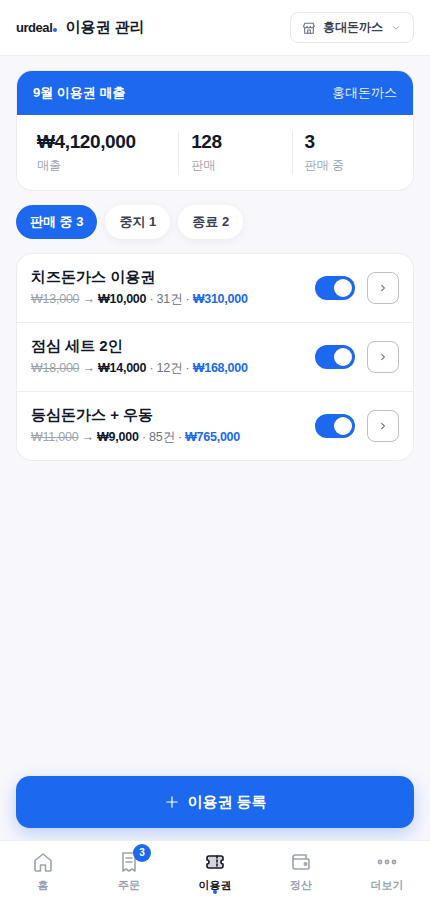
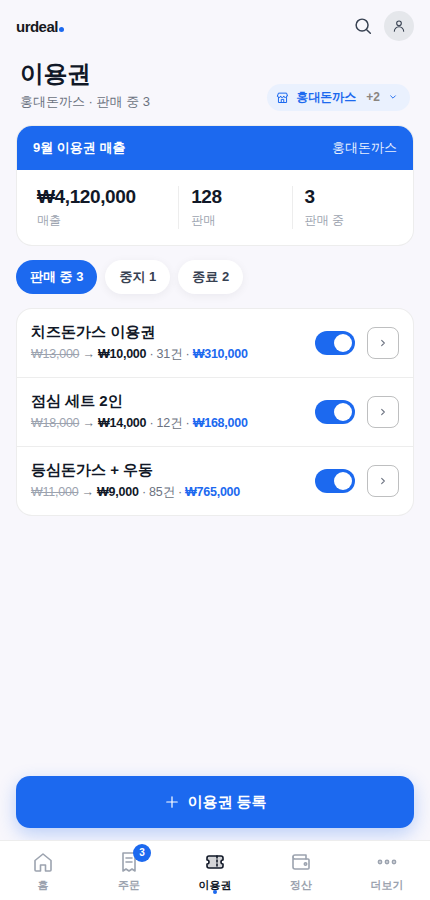
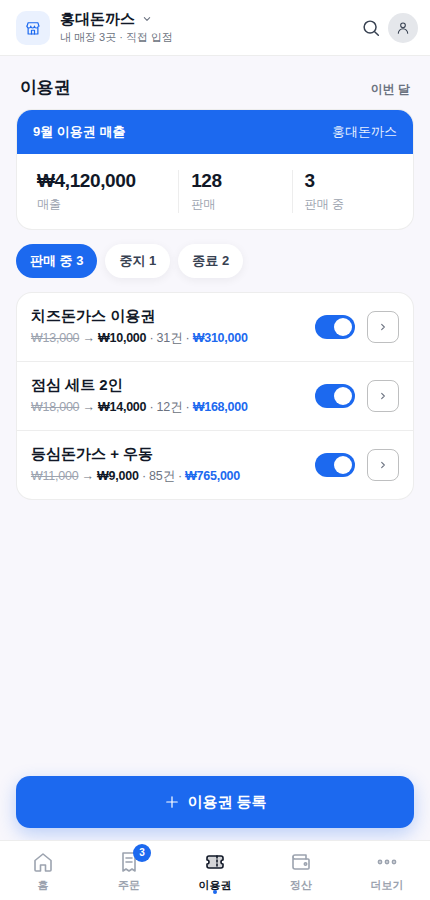
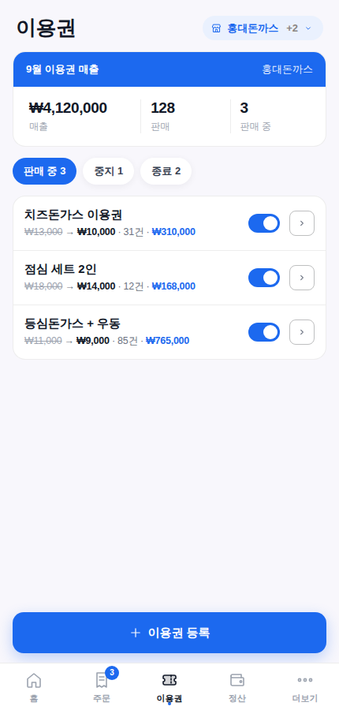
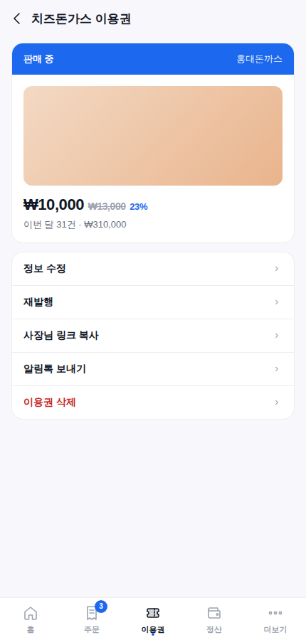
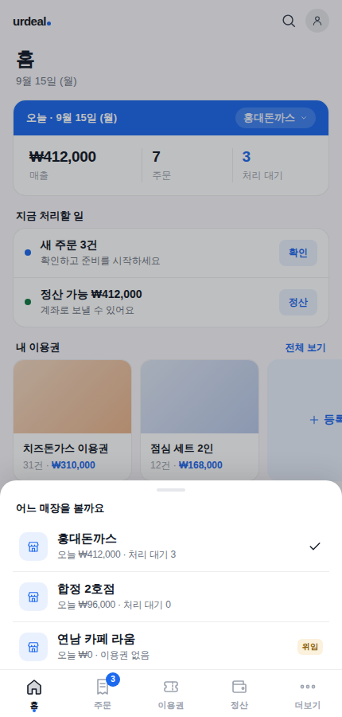
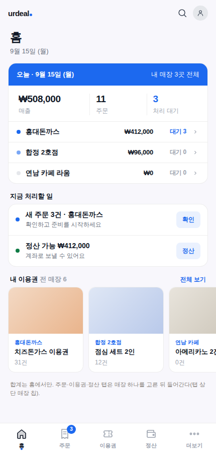
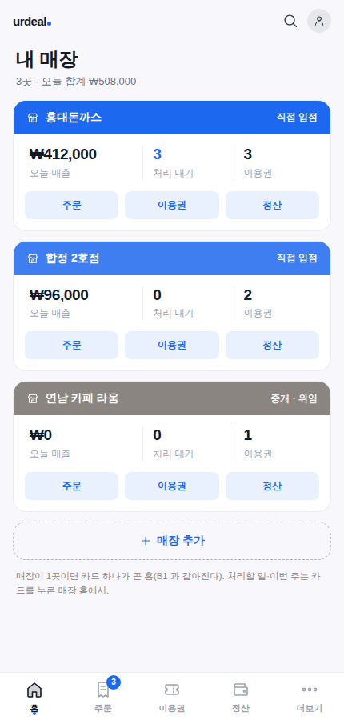
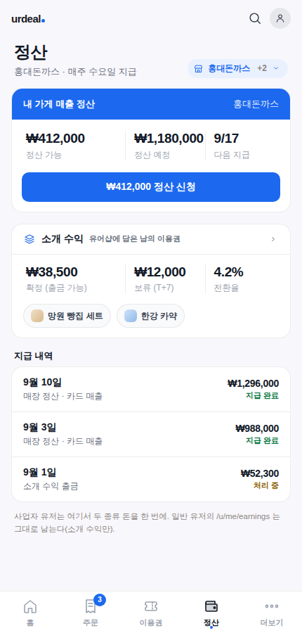

# 셀러 대시보드 2차 시안 — 헤더·제목 처리 / 다점포 홈 / 정산 안의 소개 수익 (2026-09-15)

**대표 발언(원문)**: *"잘 나오는데 지금 잘 된 것 같아? 매장이 여러개일 수 있잖아."* · *"디자인들이 아직 좀 아쉬워. 각 페이지마다 제목을 저렇게 나타내니 아쉬운 것 같기도 하고? 시안들을 좀 받아보고싶네"* · *"`/u/me/earnings` 소개 수익 페이지는 왜 따로 셀러대시보드에서 보지 않고 메인 형태에서 보는거지?"*

캔버스(편집 가능): https://claude.ai/artifact/Q7qjYsAa92VVpGr632Z3Qq — 세 페이지(A 헤더·제목 / B 다점포 / C 정산+소개수익).
색·간격·글꼴·탭 바·티켓 밴드는 `src/index.css` 토큰과 `SellerBottomTabs`·`TodayTicket`·`StoreSwitcher` 실제 값을 그대로 옮겼다. 숫자·매장 이름은 예시.

## 왜 이 시안이 필요했나 (실측)

| 질문 | 지금 코드가 하는 일 | 아쉬운 점 |
|---|---|---|
| 매장이 여러 개면? | 매장 1곳 = `sellers` 좌석 1행. 사람은 `seller_operators` 로 여러 좌석에 앉고, 헤더 우측 `StoreSwitcher`(2곳 이상일 때만 렌더)가 `POST /stores/:id/token` 으로 좌석을 바꾼다(`store-operator-model.md` 2단계, 2026-08-19 대표 확정). | 홈 숫자가 **현재 좌석만** 집계(전 매장 합계 없음) · 폰에서 전환 UI 가 헤더 구석 드롭다운이라 안 보임 · 주문·이용권·정산 탭도 매장별이라 매번 전환 · 승인 대기 매장은 전환 불가인데 화면이 이유를 안 말함 |
| 페이지 제목 | `SellerLayout title=` 이 헤더 한 줄에 로고+제목(15px)+매장 드롭다운을 같이 그린다(1차 껍데기 잔재). | 제목이 눌려 있고, 탭 페이지에선 하단 탭이 이미 위치를 말하는데 제목이 또 말한다 |
| 소개 수익이 메인 앱에 있는 이유 | 담기(소개)는 **유저 누구나** 하는 행위 → 커미션은 `users` 에 쌓이고 유저 출금 체계(`user_withdrawals`)를 쓴다. 셀러 대시보드는 `seller_token` 좌석이 있어야 열리는 **판매 도구**라 일반 유저가 못 들어간다(2026-06-15 "소개 콘솔은 메인 앱 안, 별도 로그인 X"). | **사업자 유저**는 내 가게 매출(셀러 정산 탭)과 소개 수익(`/u/me/earnings`)이 **두 곳**으로 갈린다 |

## A. 헤더·페이지 제목 (이용권 탭으로 비교)

| 안 | 그림 | 요지 | 대가 |
|---|---|---|---|
| 지금(기준) |  | 헤더 한 줄에 로고 + "이용권 관리" + 매장 드롭다운 | 제목 15px 로 눌림 |
| **A1 제목을 본문으로** |  | 헤더엔 로고·검색·프로필만. 제목 24px 이 본문 첫 줄, 매장 칩이 제목 옆 | 가장 무난. 스크롤하면 제목이 사라진다 |
| **A2 매장이 제목** |  | 매장 이름(+"내 매장 3곳 · 직접 입점")이 헤더 제목 자리, 탭하면 전환. 페이지 제목은 섹션 제목 17px | 다점포에 유리. 매장 1곳 사장님에겐 헤더가 조금 무겁다 |
| **A3 탭이 곧 위치** |   | 탭 페이지엔 헤더 없음(제목 26px + 매장 칩). 안쪽 페이지만 ← 제목 | 가장 앱다움. 검색·프로필·언어 자리가 사라진다(더보기로) |

## B. 매장이 여러 개일 때 (홈)

| 안 | 그림 | 요지 | 대가 |
|---|---|---|---|
| **B1 밴드 칩 전환** |  | 오늘 티켓 밴드의 매장 이름이 곧 전환 칩 → 바텀시트(매장별 오늘 매출·처리 대기·위임 표시·매장 추가). **지금 구조(좌석 토큰) 그대로**, 전환만 눈에 띄게 | 합계는 여전히 없다 |
| **B2 합계 + 매장별** |  | 홈은 전 매장 합계 티켓 + 매장별 분해 행 + 전 매장 이용권 레일. 주문·이용권·정산 탭은 매장 하나 고른 뒤 | 합계 API(사람 기준 집계) 신설 필요 |
| **B3 매장 카드 스택** |  | 홈이 곧 매장 카드 목록(카드마다 오늘 매출·처리 대기·이용권 + 주문/이용권/정산 바로가기). 매장 1곳이면 카드 하나 = 지금 홈 | 처리할 일·이번 주는 카드 누른 매장 홈으로 한 단계 들어간다 |

## C. 정산 탭 안에 소개 수익

내 가게 매출 정산(셀러 좌석, `payouts`) 아래에 **소개 수익** 카드(확정·보류 T+7·전환율, `/api/curator/me/dashboard`). 지급 내역도 두 종류를 한 목록에. 일반 유저용 `/u/me/earnings` 는 그대로 둔다(소개 수익만 보는 화면). 좌석에 연결된 유저 계정(`sellers.linked_user_id`)이 있을 때만 그린다.

## 구현 todo (대표가 조합을 고르면)

- [ ] A: `SellerLayout` 헤더에서 `title` 을 빼고 페이지가 자기 제목을 그린다(`SellerPageTitle` 부품 신설) — 39페이지 배선
- [ ] B1: `TodayTicket` 밴드 우측 → 매장 칩 + `StoreSheet`(바텀시트, `StoreSwitcher` 의 토큰 계약 재사용) · B2/B3 면 `GET /api/seller/my-stores/summary`(사람 기준 오늘 합계) 신설
- [ ] C: `SellerSettlementsPage` 에 `ReferralEarningsCard` — 좌석↔유저 연결 시만
- [ ] 시안 확정 뒤 `docs/design/README.md` 상태 갱신
