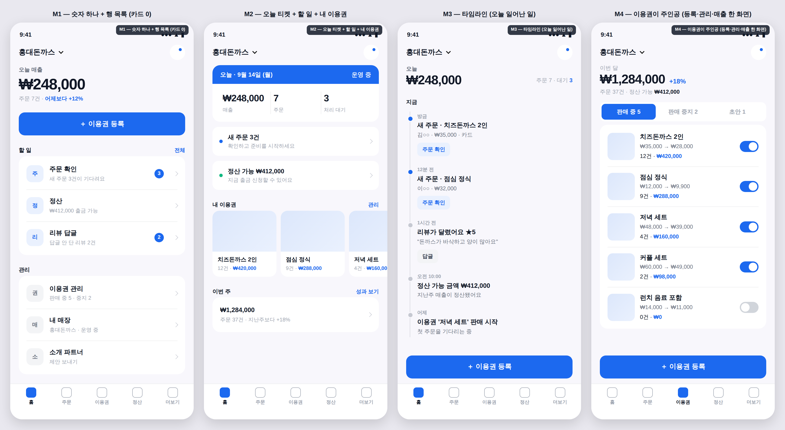
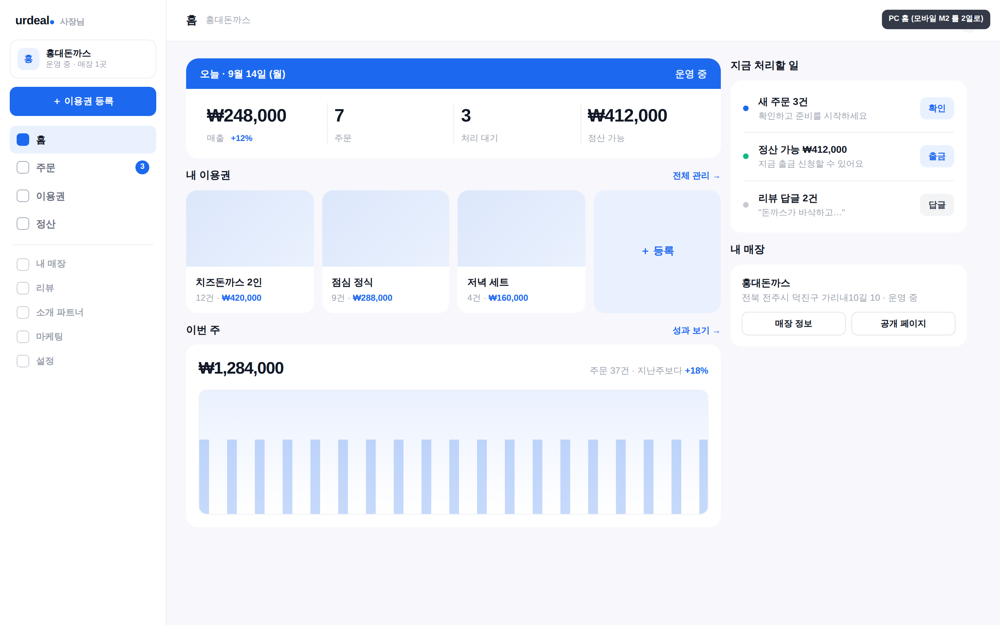

# 셀러 대시보드 — 모바일 우선 재설계 시안 (2026-09-14)

## 대표 지시 (원문, 순서대로)

1. *"배치도 제멋대로 체계적이지 않아. 다른 페이지들도 모두 확인이 필요하고."*
2. *"셀러 대시보드의 대시보드 페이지에 카드들? 섹션들 정리가 안될까? 그냥 다 때려박은 느낌이잖아."*
3. *"UX/UI 시안들 제안해봐 나한테"*
4. *"모바일 버전이 더욱 중요해. 기존의 지금 UI 전체를 뒤엎어도 되니까 시안 더 줘봐. 지금 모든 이 카드? 섹션 자체가 마음에 들지 않아. 셀러대시보드에서 이용권 등록, 관리, 매출 등 가장 중요한 부분들은 더욱 신경써야 해. 특히 모바일로 보는 것들은 더."*

⇒ 판정 기준 셋: **모바일 우선** · **카드/섹션 나열 금지** · **이용권 등록·관리·매출이 주인공**.
같은 날 앞선 껍데기 정리(PR #1429, `dashboard-rinda-2026-09.md`)는 이 결정의 *전 단계*이고, 여기서 고르는 시안에 따라 그 PR 의 카드 부품(`PrimaryActions`·`DashboardStatCard`)은 대체될 수 있다.

## 왜 "때려박은 느낌"인가 (실측)

메인 `SellerPage.tsx` 에 블록이 **14개**이고 세로 한 줄로 쌓여 있다:
매장 → 작업타일5 → 퀵트리오3 → 숫자4 → 영입자카드 → 공구현황 → 인사이트 → KPI → 차트 → 인기상품 → 처리할항목 → 신규스텝 → 공개페이지 → 문의.
세션마다 "여기 한 블록 더"가 쌓인 흔적이 주석 이력에 그대로 있다. 신규 셀러는 저 대부분을 `0`이나 빈 채로 본다.
모바일에서는 사이드바 메뉴 **14개**가 햄버거 뒤로 숨고, 본문은 PC 2열이 1열로 무너져 더 길어진다.

다른 페이지도 같은 클래스다 — 셀러 30개·어드민 40개 페이지에 검은 면 버튼, 본문 폭이 `max-w-3xl/4xl/7xl/md/sm/2xl/lg` **7종**으로 제각각(옮겨 다닐 때 화면이 출렁인다).

## 공통 뼈대 (모든 모바일 안)

- **하단 탭 5개로 대분류 고정**: `홈 · 주문 · 이용권 · 정산 · 더보기`. 나머지 메뉴는 더보기로.
- 홈은 **한 화면**에 끝난다. 스크롤해야 보이는 것은 홈에 두지 않는다.
- `이용권 등록`은 어디서든 **파란 버튼 하나**로 한 번에 닿는다(사이드바·타일·매장카드 세 곳에 흩어졌던 것).
- 토큰은 🎫 코레일톡 시스템 그대로: 바탕 `#F8F7FC` · 흰 면 · 브랜드 `#1C69EF` · 헤어라인 잉크 8% · 숫자가 주인공.

## 모바일 4안 (430px) — `assets/seller-dashboard-2026-09/seller-mobile-*.png`

| 안 | 한 줄 | 강점 | 약점 |
|---|---|---|---|
| **M1 숫자 하나 + 행 목록** | 토스 사장님 방식. 오늘 매출 한 숫자 → 파란 등록 버튼 → **행**(할 일 / 관리). 카드 0 | 가장 단순, 가장 빨리 읽힘 | 이용권 목록이 홈에 없음 |
| **M2 오늘 티켓 + 할 일 + 내 이용권** | 배민사장님 방식. 티켓(파란 밴드+숫자 셋) → 처리할 일 2줄 → 내 이용권 가로 스크롤(끝에 `＋등록`) | 등록·관리·매출이 **홈 한 화면**에 다 있음 | 블록이 M1 보다 하나 많음 |
| **M3 타임라인** | 오늘 일어난 일을 시간순. "새 주문 → 주문 확인" 버튼이 그 자리에 | 처리 동선 최단 | 조용한 날 화면이 빔 |
| **M4 이용권이 주인공** | **이용권 탭**. 이번 달 매출 한 줄 → 내 이용권 전부 행으로(판매수·매출·ON/OFF 토글) → 하단 고정 등록 버튼 | 대표가 꼽은 셋을 한 화면에 직접 놓음 | 홈이 아니라 탭 하나의 설계 |

### 추천: 홈 = M2, 이용권 탭 = M4

둘은 경쟁이 아니라 짝이다 — M2 홈의 "내 이용권" 가로 스크롤을 누르면 M4 로 들어간다. 주문 탭은 M3 의 시간순 목록을 그대로 쓴다. PC 는 같은 다섯 대분류를 왼쪽 사이드바로 펼치고 홈 본문을 M2 를 2열로 넓히면 되므로 별도 설계가 필요 없다.

## PC 3화면 (모바일을 그대로 넓힌 것) — `assets/seller-dashboard-2026-09/seller-P-*.png`

대표 *"좋네. 지금 형태 좋다. PC 버전 시안은?"* (2026-09-14, 모바일 4안을 본 직후).

- **사이드바 = 모바일 하단 탭 다섯을 세로로** (홈·주문·이용권·정산 + 헤어라인 아래 '더보기' 항목: 내 매장·리뷰·소개 파트너·마케팅·설정). 워크스페이스 카드 + 파란 등록 버튼은 PR #1429 그대로.
- **P-홈** = M2 를 2열로: 좌(오늘 티켓 숫자 넷 → 내 이용권 4장+등록 → 이번 주 차트) / 우 sticky(처리할 일 + 내 매장).
- **P-이용권** = M4 를 표로: 가격·판매·매출 열 + 토글 + 편집.
- **P-주문** = M3 시간순 목록 + 우측에 선택 주문 티켓(코드·사용 예정·주문 확인).
- 원칙: 폰과 PC 가 **같은 다섯 대분류·같은 순서·같은 부품**. 목업 원본 `mock-pc2.mjs.txt`.

## 구현 순서 (대표 확정 시)

1. 사이드바·하단 탭을 다섯 대분류로 재편(메뉴 14 → 5 + 더보기) — 뼈대 먼저
2. 홈(M2/P-홈) → 이용권(M4/P-이용권) → 주문(M3/P-주문), 화면마다 폰·PC 둘 다 렌더해 확인
3. 정산·더보기 안쪽 페이지: 본문 폭 1종으로 통일 + 검은 버튼 제거

## PC 4안 (참고 — 모바일 결정 전 단계) — `assets/seller-dashboard-2026-09/seller-main-*.png`

A 메인 다이어트(성과는 별도 메뉴) · B 한 페이지 4덩어리+섹션 제목 · C 좌우 2열(하는 것↔보는 것) · D 단계형(신규 셀러에 0 을 안 띄움).
대표가 이후 "모바일이 더 중요, 카드·섹션 자체가 싫다"로 방향을 밀어 이 넷은 **참고 자료**가 됐다. 살릴 요소: D 의 "데이터 없으면 그 덩어리 자체를 안 그린다".

## 대표 결정 대기

1. 홈 안: M2(추천) / M1 / M3
2. 이용권 탭: M4 로 갈지
3. 하단 탭 다섯 이름: `홈 · 주문 · 이용권 · 정산 · 더보기` 그대로인지 (예: 정산 → 매출)

## 구현 시 지킬 것

- 렌더해서 본다(tsc·테스트로 레이아웃은 못 잰다 — 09-14 에 내 레이아웃 회귀 둘이 렌더에서만 드러났다). 신규 셀러(전부 0)와 운영 중 셀러 **두 인격** 모두.
- 모바일 뷰포트 룰(`h-[100dvh]`·`flex-1 min-h-0`)·`StickyActionBar` — 하단 고정 등록 버튼이 탭바와 겹치지 않게.
- 목업 생성기 원본: `assets/seller-dashboard-2026-09/mock-mobile.mjs.txt` · `mock-pc.mjs.txt`(Playwright, 토큰 그대로) — 시안을 더 그릴 때 재사용.

## ✅ 구현 완료

(대표 선택 후 commit hash 를 여기에)
