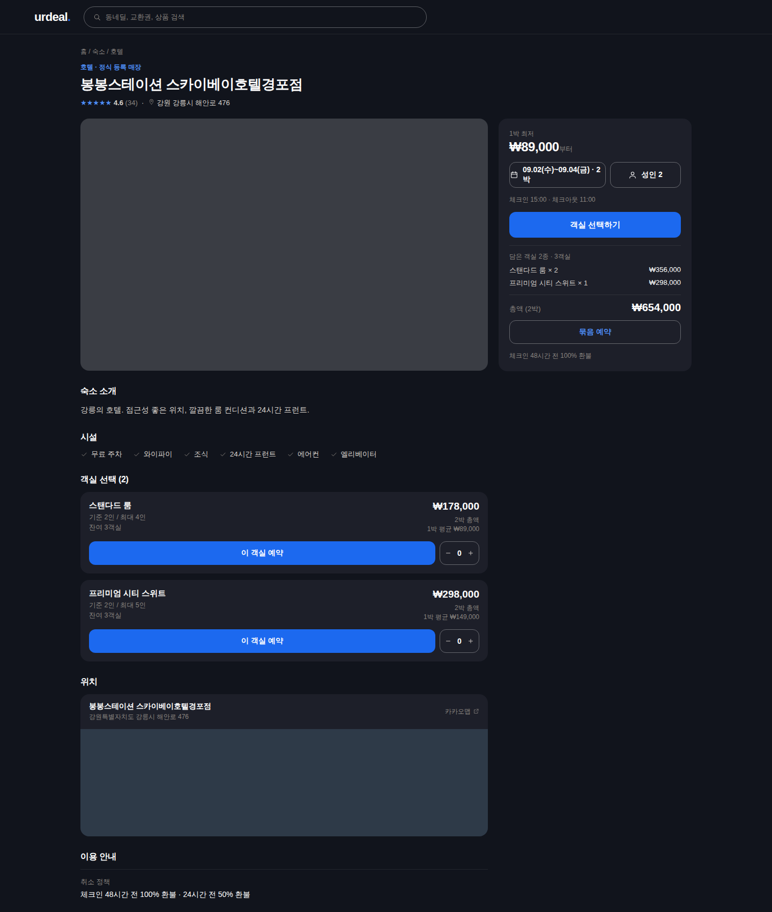
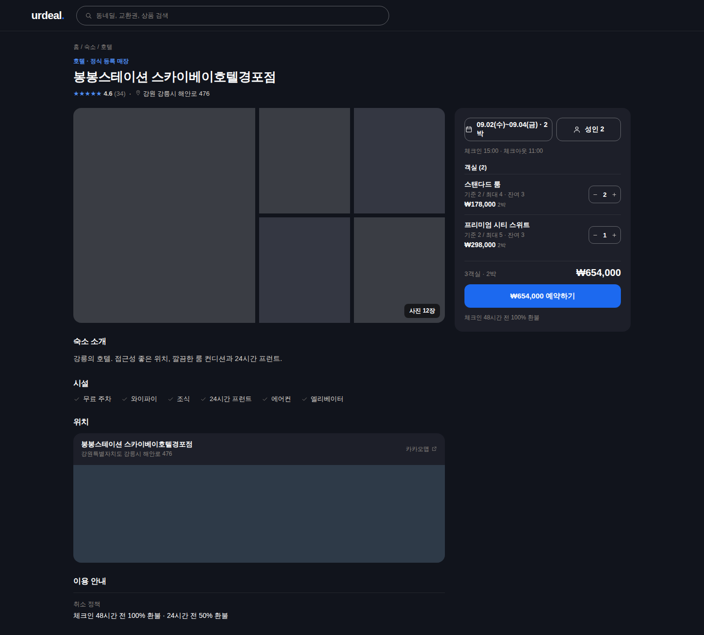
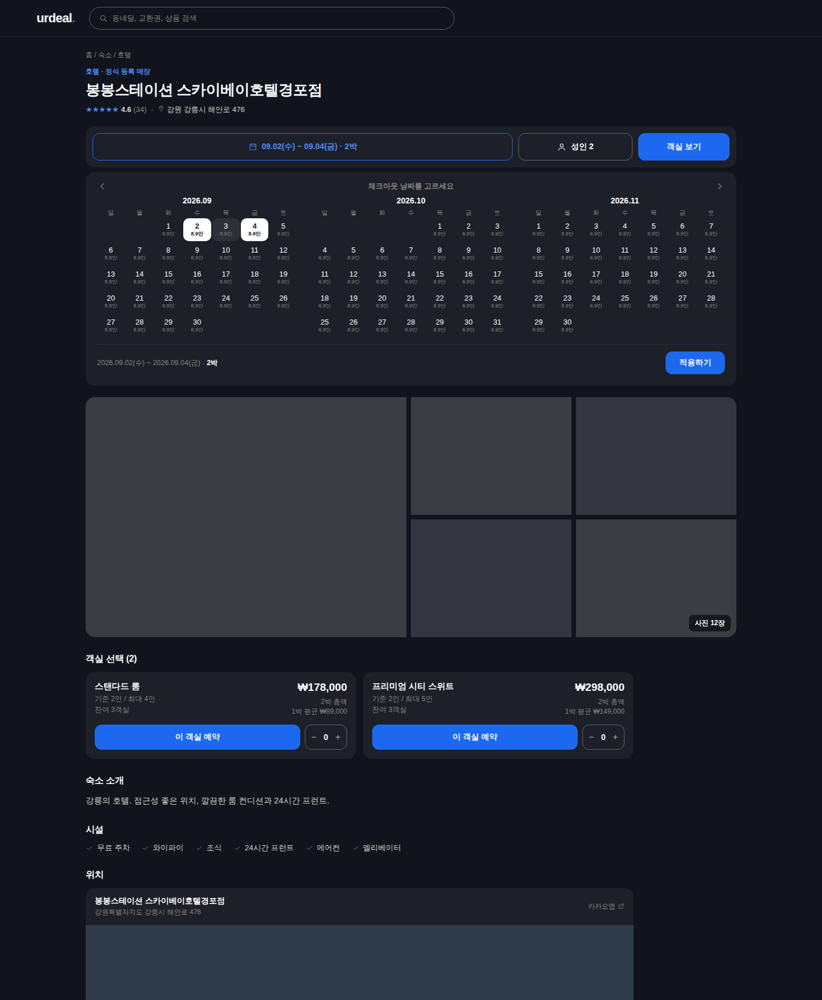

# 숙소 이용권 상세 PC 배치 시안 3안 (2026-09-02)

**캔버스**: https://claude.ai/code/artifact/a4c0d216-8e98-4d63-8c07-ce416c7bf146
**배경**: 대표 라이브 화면(`/stays/2712`, 1540px 다크) 신고 — *"UI 배치와 겹쳐지는 문제 모두를 해결해야 할 것 같아. 지금 배치도 이상적이지 않아"* + *"1박만 하는게 아니라 연박도 할 수 있는데 그 부분도 확인해줘"* + *"UI 배치 부분에 대해서 시안 제안 3개 정도 해봐"*.
**상태**: 대표 **B안 선택** (2026-09-02 *"B안으로 하는데 날짜 있는 버튼 부분이 2줄로 되고 보기 안좋아"*) → 날짜·인원 트리거를 세로 두 줄로 바꿔 구현.

## 라이브에서 확인한 결함 (세 안 공통으로 고친다)
| # | 증상 | 원인 (코드) |
|---|---|---|
| ① | 달력 팝오버가 카카오맵 아래로 깔림 | `<aside lg:sticky>` 가 z-index 없이 스택 컨텍스트를 만들고, 지도(RestaurantMiniMap 안 카카오 레이어 z≥1)가 그 위로 올라온다 → 아사이드 `lg:z-*` + 지도 컨테이너 `isolate` |
| ② | 연박 선택 불가 | `StayDateGuestPicker.pickDay`: 초기값이 이미 체크인+1박이라 `rangeDone` 이 항상 참 → 모든 클릭이 "새 체크인 + 1박" 이 되어 체크아웃을 고를 수 없다. 서버(가용 조회·결제 야간 배치)는 연박을 받는다 → 단계 상태(체크인 고르는 중 / 체크아웃 고르는 중) 도입, 헤더 문구도 단계에 맞춰 |
| ③ | 제목 위 라벨 `hotel · 정식 등록 매장` | `DetailTitleHeader storeName={stay.property_type}` 원본 영문 → `propertyTypeLabel()` |
| ④ | 오른쪽 열이 날짜 상자 하나뿐 | 아사이드에 가격·행동·합계가 없다 — 아래 3안 |

## 3안
| A안 · 예약 카드를 채운다 | B안 · 객실을 오른쪽 패널로 | C안 · 풀폭 예약바 + 1열 |
|---|---|---|
|  |  |  |
| 지금 2단 구조 유지. 우측 카드에 1박 최저가 · 날짜/인원 · "객실 선택하기"(객실 섹션으로 스크롤) · 담은 객실 합계 · 취소 정책 한 줄 | 날짜/인원 → 객실 목록(수량 스테퍼) → 총액 → 예약 버튼이 한 카드에서 끝난다(호텔 OTA). 좌측은 읽는 것만 | 제목 아래 가로 예약바, 달력은 바 아래로 펼침 → 지도와 겹칠 것이 구조적으로 없다. 갤러리 풀폭, 객실 2열 |
| 장점: 변경 최소, 공구 상세와 같은 문법 / 단점: 객실 고르러 내려갔다 다시 올라온다 | 장점: 예약 동선 한 곳, 오른쪽이 안 빈다 / 단점: 객실 사진·긴 설명을 패널에 못 넣는다(객실 5종+ 이면 길어진다) | 장점: 달력 세 달, 겹침 0 / 단점: 스크롤하면 예약 버튼이 사라져 상단 sticky 바가 따로 필요 |

## ✅ 구현 완료 (B안 + 결함 ①~④)
- `stay-detail/StayBookingPanel.tsx` 신설: 날짜/인원 → 객실 행(수량) → 총액 → "₩N 예약하기"(묶음 예약 모달). 카드 테두리 0 + lift.
- `StayDateGuestPicker.tsx`: `pickRange` 순수함수 + 단계 상태(연박), 트리거 세로 두 줄, 헤더 문구 단계 연동.
- `StayDetailPage.tsx`: 아사이드 `lg:z-20` + 지도 `isolate`, 객실 카드 PC 숨김, `propertyTypeLabel`, 취소 정책 문장 SSOT. 885 → 873줄.
- 가드: `stay-detail-pc-booking-panel.test.ts` 10건 + 주입 2건.
