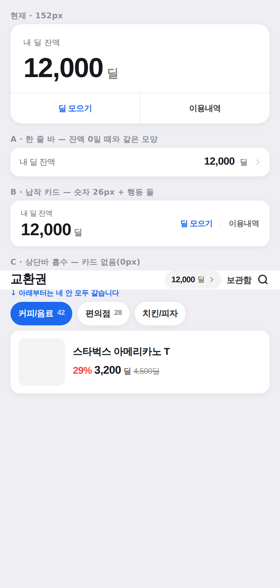

# 딜 잔액 카드 — 안 B "납작 카드" (2026-09-30 대표 확정)

대표: ***"교환권 페이지 UI 변경하고 싶어. 내 딜 잔액 부분이 너무 크달까?"***

> ⚠️ 2026-09-14 의 **안 A3**(`vouchers-deal-balance-2026-09-14.md`)를 이 결정이 대체한다.
> 대체된 것은 **크기와 배치**뿐이고, A3 가 지키던 이유 넷은 그대로다(아래 §4).

## 1. 실측 — 카드 하나가 첫 화면의 3분의 1이었다

430px 에서 첫 상품 카드 위에 쌓인 것(`visual-preview.mjs` 실측):

| 층 | 높이 |
|---|---|
| 상단바(교환권 · 보관함 · 검색) | 55 |
| **딜 잔액 카드** | **152** |
| 카테고리 칩 | 56 |
| 브랜드 스트립 | 117 |
| 섹션 헤더(커피/음료 교환권 · 정렬) | 50 |
| **합** | **≈440 / 932** |

첫 상품이 **화면 절반 아래**에서 시작했고, 그중 가장 큰 한 덩어리가 잔액 카드였다.

## 2. 시안 넷 (실제 디자인 토큰으로 렌더 · 높이는 실측)

| 안 | 높이 | 내용 |
|---|---|---|
| 현재(A3) | 152px | 두 층 · 숫자 42px · 아래층에 행동 둘 |
| A · 한 줄 바 | 44px | 잔액 0 일 때와 **같은 모양**. 행동은 빠짐 |
| **B · 납작 카드 ✅** | **70px** | 한 줄에 [라벨+숫자 28px] + [딜 모으기 │ 이용내역] |
| C · 상단바 흡수 | 0px | 제목 줄 오른쪽에 `12,000딜 ›` 알약 |

**대표 확정: B.** A 는 82px 을 더 줄이지만 '딜 모으기'가 사라지고, C 는 잔액이 눈에 덜 띈다.
B 는 **행동 둘을 유지하면서 82px** 을 상품에 돌려준다.

## 3. 좁은 레일(PC 248px)은 행동을 아래로

26px 숫자 + 행동 둘을 한 줄에 넣으면 7자리 잔액(999,999)에서 넘친다(필요폭 ≈248 > 가용 216).
`compact` 에서는 행동이 아래 줄로 내려간다. 가드가 고정.

## 4. 🔴 배치가 바뀌어도 그대로인 것 넷 (A3 승계)

1. **채운 브랜드 버튼 0** — 블루는 '딜 모으기' 글자 한 곳에만.
2. **고아 링크 0** — "딜 모으는 방법"을 카드 밖에 다시 띄우지 않는다.
3. **"1딜 = 1원" 안 쓴다** — 대표 *"값어치를 말할 필요는 없어"*. 아래 가격표가 이미 말한다.
4. **잔액 0 은 큰 카드를 안 쓴다** — 비로그인도 0 이라 "당신은 0" 상자로 시작한다.

## 5. 이 카드는 마이도 쓴다

`user-profile/TeamPointsCard` 가 같은 부품을 쓴다(2026-09-28 통합). **마이도 같이 작아진다** — 의도다.

## ✅ 구현 완료
- 부품: `src/pages/vouchers/DealBalanceCard.tsx`
- 가드: `deal-balance-card-2026-09-14.test.ts`(재조준) · `deal-balance-awaiting-2026-09-16.test.tsx`
  · `vouchers-top-chrome.test.ts`(큰 카드 표식 42px→26px) · 주입 8건 **전부 빨간불 확인**
- commit: (PR 본문 참조)
